# SynapseMD Architecture

System design, layer responsibilities, and deployment models. For **how to extend** the codebase (commands, skills, specialists, data, platform), see the **[Developer Guide](developer-guide.md)**. For a clinician-friendly worked example, see **[SME Guide: Add a Command, Skill, and Specialist](sme-guide-add-command-skill-specialist.md)**.

## Table of Contents

1. [Project Overview](#1-project-overview)
2. [Project Structure](#2-project-structure)
3. [Role of Each Folder](#3-role-of-each-folder)
4. [Separation of Concerns](#4-separation-of-concerns)
5. [Integration with Claude Code & Custom LLMs](#5-integration-with-claude-code--custom-llms)
6. [Command Execution Flows](#6-command-execution-flows) — IDE/CLI command · skill · specialist sequences in [§6.3](#63-ide--cli--providing-and-invoking-commands-skills-specialists)
7. [Repository Layout](#7-repository-layout)
8. [Deployment Models](#8-deployment-models)

---

## 1. Project Overview

SynapseMD is a **file-based personal health data management system** with an optional **enterprise platform** (`platform/`). Locally, health data lives in JSON files and intelligence is provided by slash commands, skills, and specialists executed by Claude Code (or any compatible LLM agent). On the platform path, **PostgreSQL is the system of record**; JSON is an import/export adapter.

**Dual runtime:**

| Mode | Stack | Persistence |
|------|-------|-------------|
| **Local CLI** | `commands/` + `skills/` + `specialists/` + `data/` | `data/*.json` |
| **Enterprise platform** | FastAPI + JWT + Postgres + FHIR + MCP + anonymization + audit | Postgres (`HEALTH_STORE=postgres`) |

Both share Module 21 AI logic in `platform/synapsemd_platform/ai/prediction.py`.

**Core architecture (local CLI):**

```
User Input (natural language or slash commands)
        │
        ▼
  Claude Code CLI  ──── reads ────▶  commands/*.md   (what to do)
        │                            skills/*/SKILL.md (how to analyze)
        │                            specialists/*.md (domain expertise)
        │
        ├── reads/writes ──▶  data/                  (health records, JSON)
        └── generates   ──▶  Report/                 (HTML/Markdown output)
```

---

## 2. Project Structure

```
SynapseMD/
│
├── .claude/                    # Claude Code workspace (symlinks — see §5)
│   ├── settings.local.json
│   ├── commands      -> ../commands
│   ├── skills        -> ../skills
│   └── specialists   -> ../specialists
│
├── commands/                   # Source of truth — 60+ slash commands
├── skills/                     # Source of truth — 19 analyzer skills
├── specialists/                # Source of truth — medical specialty profiles
│
├── data-example/               # Example JSON templates for all domains
├── data/                       # Live user data (gitignored)
├── data/reference/             # Committed read-only lookup databases
│
├── scripts/                    # setup-data.sh, validation, Python helpers
├── tests/                      # unit/, integration/, e2e/, release/, eval/
├── docs/                       # Shipped documentation
├── platform/                   # Enterprise FastAPI package (synapsemd_platform)
├── deploy/                     # OpenAPI bridge, K8s manifests
│
├── Report/                     # Generated report output
├── README.md
└── pyproject.toml              # Root pytest config (≥95% coverage gate)
```

---

## 3. Role of Each Folder

### `commands/`

Slash command definitions — one `.md` file per command. Each file contains YAML frontmatter, execution steps, data contracts, and output format. Commands handle CRUD and delegate analysis to skills.

See [developer-guide.md § Recipe: Add a command](developer-guide.md#6-recipe-add-a-command).

### `skills/`

Analyzer modules for complex, multi-step analysis. Each skill lives in its own subdirectory with `SKILL.md` plus optional supporting docs and templates.

See [developer-guide.md § Recipe: Add a skill](developer-guide.md#7-recipe-add-a-skill).

### `specialists/`

Medical specialty consultation profiles used by `/consult` and `/specialist`. Flat `.md` files with safety red lines and output formats.

See [developer-guide.md § Recipe: Add a specialist](developer-guide.md#8-recipe-add-a-specialist).

### `data-example/` and `data/`

- `data-example/` — committed templates; copied to `data/` via `./scripts/setup-data.sh`
- `data/` — live user health data (gitignored)
- `data/reference/` — food, vaccine, and interaction lookup databases

Schema reference: [data-structures.md](data-structures.md).

### `platform/`

Enterprise FastAPI application: multi-tenant auth, **Postgres + Alembic + RLS**, `HealthDataService` (profile / allergy / gout with FHIR JSONB on write), S3-compatible object store (URI + hash in DB), command catalog, PHI anonymization, command orchestrator, MCP server, Module 21 AI REST routes, audit events.

Compose `core` profile runs API + Postgres 16 with `HEALTH_STORE=postgres`. See [local-development.md](local-development.md), [platform/README.md](../platform/README.md), [enterprise-platform-architecture.md](enterprise-platform-architecture.md), and [enterprise-platform-implementation-plan.md](enterprise-platform-implementation-plan.md).

### `tests/`

426 tests, ~98% coverage on `synapsemd_platform`. CI enforces ≥95% via `.github/workflows/platform-ci.yml` (includes Postgres RLS + Alembic). Local Docker Desktop: set `POSTGRES_TEST_URL` to a `synapsemd_test` database — never the Compose app DB.

### `.claude/`

Claude Code runtime workspace. `commands/`, `skills/`, and `specialists/` are **symlinks** to repo root — not copies. Configuration in `settings.local.json` (tool permissions, MCP servers).

Repair symlinks: `./scripts/link-claude-workspace.sh`

---

## 4. Separation of Concerns

```
┌─────────────────┬───────────────────────────────────────────────────────┐
│ Layer           │ Responsibility                                        │
├─────────────────┼───────────────────────────────────────────────────────┤
│ Commands        │ User intent parsing, data CRUD, routing to skills     │
│ Skills          │ Deep analysis, pattern detection, HTML report output  │
│ Specialists     │ Clinical domain expertise, MDT consultation logic     │
│ Data (JSON)     │ Local CLI persistence — pure data, no logic           │
│ Data (Postgres) │ Platform SoR — RLS tenant isolation, Alembic schema   │
│ Scripts         │ Batch processing, testing, standalone report gen      │
│ Platform        │ Auth, tenancy, PHI safety, REST/MCP, audit, adapters  │
│ .claude/        │ Runtime config — tool permissions, MCP, symlinks      │
└─────────────────┴───────────────────────────────────────────────────────┘
```

**Key design principles:**

1. **Commands own the UX** — arguments, data paths, output format; delegate analysis to skills.
2. **Skills own the analysis** — read widely, produce reports; no CRUD or user interaction.
3. **Specialists own the clinical lens** — interpret summaries in MDT flow, not raw dumps.
4. **Data files are schema-only** — compute derived values at runtime in commands/skills.
5. **Scripts are escape hatches** — deterministic logic shared with platform where possible.
6. **Platform adds safety and persistence** — anonymization, audit, guardrails, `HealthDataService`; does not duplicate markdown specs.

Full extension rules: [developer-guide.md](developer-guide.md).

---

## 5. Integration with Claude Code & Custom LLMs

### How Claude Code Loads the System

1. Reads `.claude/settings.local.json` for allowed tools and MCP configuration
2. Registers files in `.claude/commands/` as slash commands (filename = command name)
3. Exposes skills via the Skill tool
4. Loads specialists for consultation commands

**Source of truth:** edit `commands/`, `skills/`, `specialists/` at repo root. Verify symlinks:

```bash
ls -la .claude/commands .claude/skills .claude/specialists
./scripts/link-claude-workspace.sh   # repair if needed
```

### Skill Invocation

- Directly by user or via `Skill("health-trend-analyzer")` from a command step
- `SKILL.md` defines trigger conditions and analysis steps

Validate command structure: `./scripts/validate-command.sh allergy`

Full runtime sequences (CRUD, skills, specialists, platform LLM / Module 21) are in [§6 Command Execution Flows](#6-command-execution-flows).

### Custom or Self-Hosted LLM

Any agent with filesystem tools (Read, Write, Bash, Glob) and multi-step markdown following can run the system. For production multi-tenant deployments, use the built-in platform MCP server (`synapsemd-mcp`) rather than ad-hoc wrappers.

### Environment Variables

| Variable | Purpose | Default |
|----------|---------|---------|
| `ANTHROPIC_MODEL` | Override Claude model | `claude-sonnet-4-6` |
| `CLAUDE_CODE_MAX_OUTPUT_TOKENS` | Max tokens per tool write | `32000` |
| `DATA_DIR` | Override data storage path | `./data/` |

---

## 6. Command Execution Flows

**Local CLI is agent-driven** (markdown playbooks in `commands/`, `skills/`, `specialists/`). **Platform is code-orchestrated** (health-data CRUD → Postgres, or anonymize → route → LLM / Module 21). Skills and specialist fan-out as markdown happen on the CLI path; the platform does **not** re-parse those files at runtime for generic commands.

### 6.1 Overview (decision flow)

```mermaid
flowchart TD
  U[User issues slash command] --> RT{Runtime?}
  RT -->|Cursor / Claude Code| CLI[Load commands/*.md]
  RT -->|API / MCP| PLAT[CommandOrchestrator / AIService]

  CLI --> T{Command type}
  T -->|CRUD e.g. /allergy| V1[Read/Write data/*.json]
  T -->|Analyzer e.g. /sleep analyze| SK[Invoke skills/*/SKILL.md]
  T -->|/consult or /specialist| SP[Parallel specialists/*.md]
  T -->|/ai predict|analyze| M21[Module 21 synapsemd-ai script]
  SK --> V2[Read trackers → report]
  SP --> COORD[consultation-coordinator.md]
  V1 --> OUT[Response + disclaimers]
  V2 --> OUT
  COORD --> OUT
  M21 --> OUT

  PLAT --> KIND{command?}
  KIND -->|profile / allergy / gout| HD[HealthDataService]
  HD --> STORE{HEALTH_STORE}
  STORE -->|postgres| PG[(PostgreSQL + RLS)]
  STORE -->|json| JF[LegacyJsonAdapter]
  STORE -->|dual| PG
  KIND -->|ai| M21P[AIPredictionEngine]
  KIND -->|other| ANON[Anonymize PHI]
  ANON --> RTR[HealthLLMRouter]
  RTR --> LLM[LLM Provider]
  LLM --> GR[Guardrails + deanonymize + audit]
  M21P --> AUD[Audit]
  HD --> AUD
  GR --> OUT2[API / MCP response]
  AUD --> OUT2
  PG --> OUT2
  JF --> OUT2
```

### 6.2 What calls what

| Command kind | Skills | Specialists | External LLM | Module 21 |
|--------------|--------|-------------|--------------|-----------|
| CRUD (`/allergy`, `/profile`, `/gout`, …) | No | No | CLI: agent LLM follows markdown steps. Platform: `HealthDataService` (no LLM) | No |
| Analyzer (deep `/sleep`, etc.) | Yes (`SKILL.md`) | No | CLI: agent + skill steps | No |
| `/consult`, `/specialist` | No | Yes (parallel Tasks) | CLI: many LLM subagents | No |
| `/ai predict` / `/ai analyze` | Optional report skill | No | Prefer **no** (local scoring) | Yes (`synapsemd-ai`) |
| Platform generic `execute` | No (not markdown) | No (not MDT fan-out) | Yes (after anonymize) | Only if `command=ai` |

### 6.3 IDE / CLI — providing and invoking commands, skills, specialists

On the **IDE or Claude Code CLI** there is no compiled router. Runtime components are:

| Component | Role |
|-----------|------|
| **Host (IDE / CLI)** | Cursor or Claude Code process; slash-command registry; tool permission gate (`.claude/settings.local.json`) |
| **Main agent** | Primary conversation loop; loads command playbooks; decides tool calls |
| **Main LLM** | Model backing the main agent (e.g. Claude via Anthropic API / configured provider) |
| **Tool layer** | `Read` / `Write` / `Bash` / `Glob` / `Skill` / `Task` (and optional MCP) |
| **Skill runtime** | Loads `skills/*/SKILL.md` into the **main agent** context (same agent loop; usually **no** new subagent) |
| **Task subagent(s)** | Isolated agent loops spawned by `Task`; each has its **own LLM** turn(s) |
| **Subagent LLM(s)** | Model instance(s) for each Task (same provider family unless configured otherwise) |
| **Playbooks** | `commands/*.md`, `skills/*/SKILL.md`, `specialists/*.md` (via `.claude/` symlinks) |
| **Data / Report** | `data/*.json` vault and optional `Report/` outputs |

#### Runtime component map

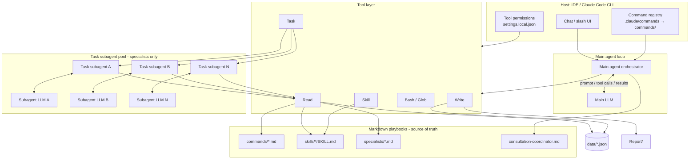

#### Shared bootstrap (session start)

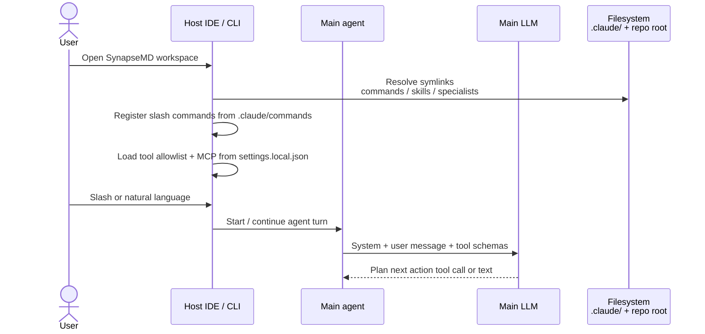

#### Authoring — developer provides an artifact

Dropping a new markdown file under the repo-root folders is enough for the next IDE/CLI session to discover it (no separate compile step on the local path). Repair symlinks with `./scripts/link-claude-workspace.sh` if needed. Recipes: [developer-guide.md](developer-guide.md).

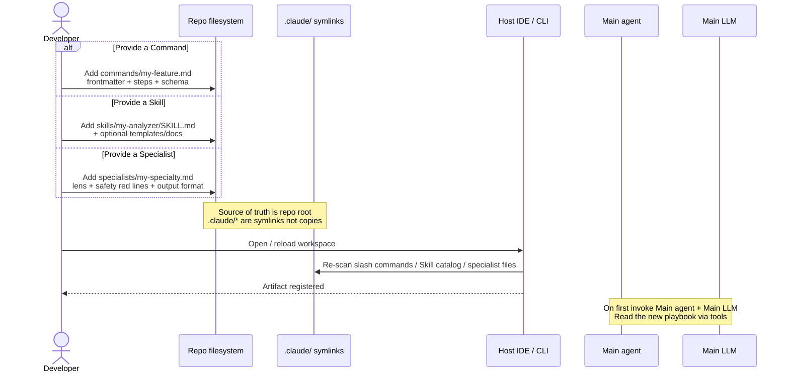

| Artifact | What the developer provides | Discovery surface | Runtime executor |
|----------|-----------------------------|-------------------|------------------|
| **Command** | `commands/<name>.md` | Slash `/<name>` | **Main agent** + **Main LLM** + Read/Write |
| **Skill** | `skills/<id>/SKILL.md` | Skill tool / command routing | **Main agent** + **Main LLM** (Skill injects playbook; typically no Task) |
| **Specialist** | `specialists/<specialty>.md` | `/consult`, `/specialist` | **Task subagent(s)** + **Subagent LLM(s)**; Main agent coordinates |

#### (1) Command — technical component flow (`/allergy add …`)

Commands own **UX + CRUD**. One main-agent loop; **no** Task subagents unless the playbook later routes to a skill/specialist path.

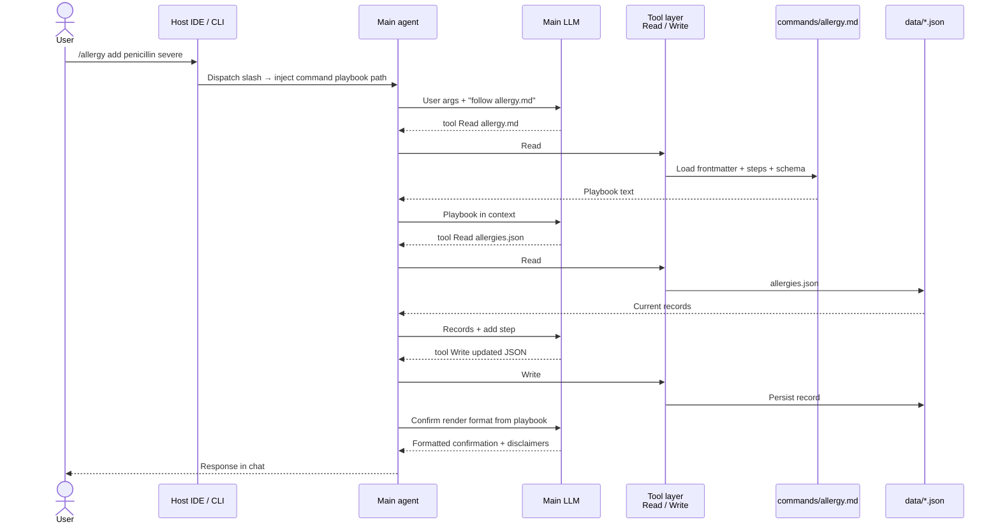

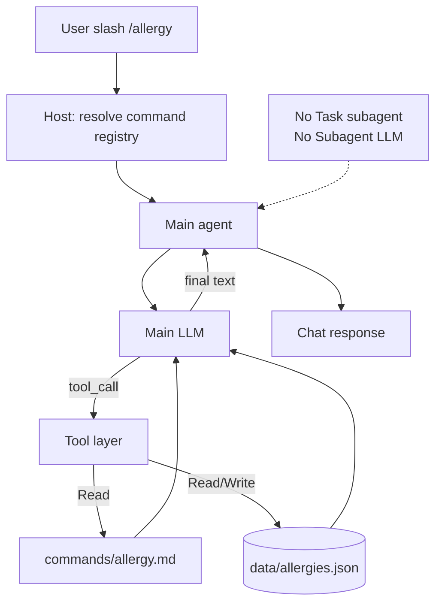

Steps in practice:

1. Host matches `allergy` → `.claude/commands/allergy.md` (symlink to `commands/allergy.md`)
2. Main agent + Main LLM load YAML frontmatter and numbered steps via `Read`
3. Tool calls perform vault CRUD (`data/allergies.json`)
4. Main LLM renders the command’s output format back through the main agent

#### (2) Skill — technical component flow (`/sleep analyze` → `sleep-analyzer`)

Commands own UX/routing; **skills own deep analysis**. The **Skill** tool loads `SKILL.md` into the **same main agent** context. Analysis is still Main LLM–driven (multi-step tool use). Task subagents are **not** required unless a specific skill playbook asks for them.

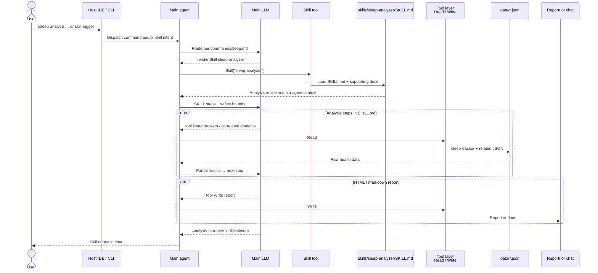

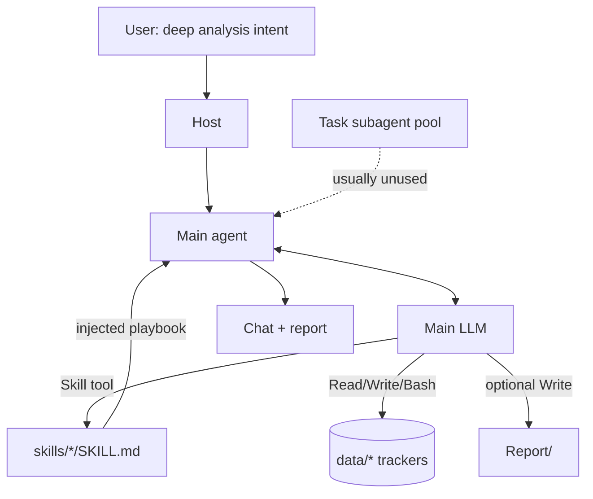

#### (3) Specialist — technical component flow (`/consult` / `/specialist`)

Specialists are **clinical lenses** executed as **Task subagents**, each with its own LLM. The **main agent** gathers data, fans out Tasks, then merges via `consultation-coordinator.md` (still on the main agent + Main LLM).

**Multidisciplinary `/consult`:**

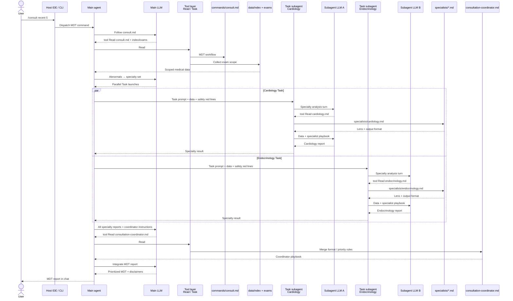

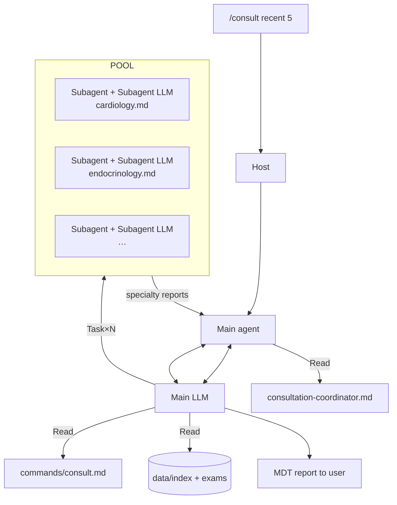

**Single `/specialist` (one Task subagent):**

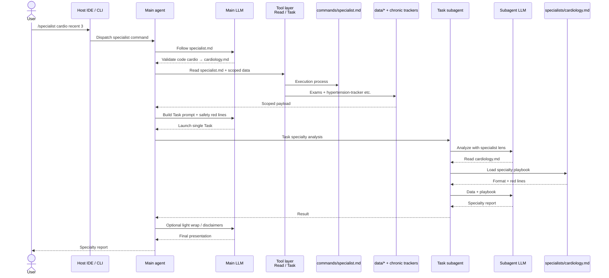

Key sources: `commands/consult.md`, `commands/specialist.md`, `specialists/*.md`, `specialists/consultation-coordinator.md`. Safety red lines (no doses, no prescribing, no mortality prognosis, no definitive diagnosis) are embedded in every specialty Task prompt.

#### Side-by-side — technical components (IDE / CLI)

| Artifact | Playbook | Main agent | Main LLM | Skill tool | Task subagent(s) | Subagent LLM(s) | Typical I/O |
|----------|----------|------------|----------|------------|------------------|-----------------|-------------|
| **Command** | `commands/<name>.md` | Yes (orchestrator) | Yes | No | No | No | Args → vault CRUD → short UX |
| **Skill** | `skills/<id>/SKILL.md` | Yes (same loop) | Yes | Yes (inject recipe) | Rare / optional | No* | Wide reads → analysis / `Report/` |
| **Specialist** | `specialists/<s>.md` | Yes (fan-out + merge) | Yes (route + coordinate) | No | Yes (1..N) | Yes (1..N) | Scoped data → clinical opinion → MDT merge |

\*Unless a skill playbook explicitly spawns `Task`s.

### 6.4 Platform — API / MCP

Platform uses command *names* and anonymized *context*. Generic commands go through `CommandOrchestrator`; `/ai predict|analyze` goes through `AIService` / Module 21 and does **not** use `HealthLLMRouter`.

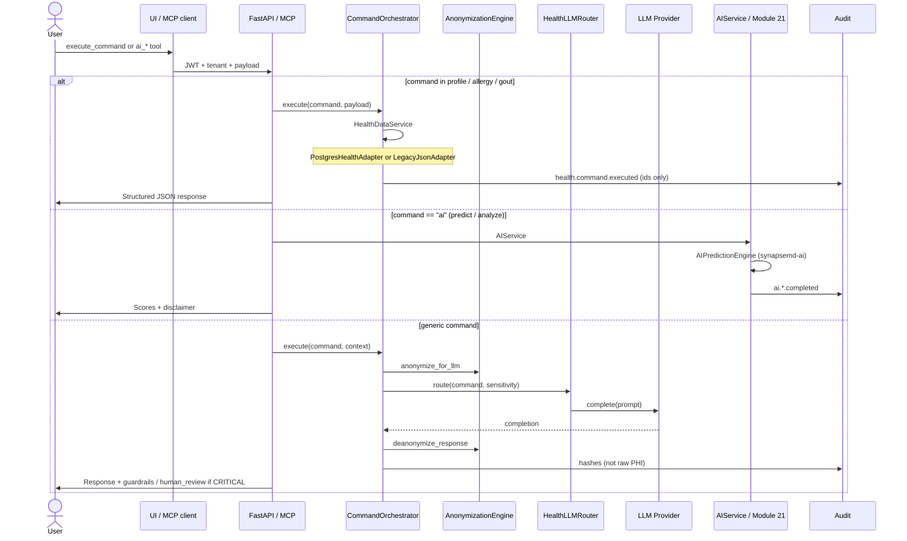

| Role | Path |
|------|------|
| Orchestrator | `platform/synapsemd_platform/services/command_orchestrator.py` |
| Health data | `platform/synapsemd_platform/services/health_data.py`, `adapters/` |
| AI facade | `platform/synapsemd_platform/services/ai_service.py` |
| Module 21 | `platform/synapsemd_platform/ai/prediction.py` |
| Router / providers | `platform/synapsemd_platform/llm/router.py`, `…/llm/providers.py` |
| Anonymization | `platform/synapsemd_platform/anonymization/engine.py` |
| CLI prediction wrapper | `scripts/ai_prediction.py` |

Platform `consult` is treated as **CRITICAL** (strongest model tier + human-review posture) but still runs the **generic LLM path** — not the CLI-style parallel specialist markdown Tasks.

---

## 7. Repository Layout

Current layout (symlinks active, platform integrated):

```
SynapseMD/
├── .claude/
│   ├── settings.local.json
│   ├── commands      -> ../commands
│   ├── skills        -> ../skills
│   └── specialists   -> ../specialists
├── commands/                         # 60+ commands
├── skills/                           # 19 skills
├── specialists/                      # flat .md files
├── data/                             # gitignored (except data/reference/)
├── data-example/
├── docs/                             # includes developer-guide.md
├── scripts/                          # setup-data.sh, link-claude-workspace.sh, validate-command.sh
├── tests/                            # 426 tests (unit / integration / e2e / release / eval)
└── platform/                         # synapsemd_platform FastAPI package
    ├── alembic/                      # schema migrations
    └── synapsemd_platform/adapters/  # Postgres + JSON health stores
```

**First-time setup:**

```bash
./scripts/setup-data.sh
./scripts/link-claude-workspace.sh
```

---

## 8. Deployment Models

### Model 1: Local CLI (default)

Users clone the repo and interact via Claude Code or Cursor:

```bash
git clone https://github.com/maruthis/SynapseMD.git
cd SynapseMD
./scripts/setup-data.sh
./scripts/link-claude-workspace.sh
claude
# /profile set 175 70 1990-01-01
```

**Pros:** No infrastructure, fully private, zero cost beyond API usage.  
**Cons:** Requires Claude Code CLI; no built-in web UI.

### Model 2: Enterprise Platform (REST + MCP)

Run the FastAPI platform for multi-tenant API access and chatbot integration:

```bash
cd platform
docker compose --profile core up --build
# HEALTH_STORE=postgres; Alembic runs on API start
# http://localhost:8000/docs
```

Or without Docker (SQLite/JSON for inner-loop tests):

```bash
cd platform
pip install -e ".[dev]"
uvicorn synapsemd_platform.api.main:app --reload
synapsemd-mcp   # MCP server for AnythingLLM / Open WebUI
```

```
UI / Chatbot ──▶ MCP or REST ──▶ synapsemd_platform ──▶ Postgres + FHIR + audit
                                      │
                                      ├── HealthDataService (profile / allergy / gout + FHIR JSONB)
                                      ├── Object store (URI + hash; blob not in Postgres)
                                      ├── Command catalog (`GET /admin/commands`)
                                      ├── CommandOrchestrator (generic LLM commands)
                                      ├── AIService (Module 21 /ai routes)
                                      └── PHI anonymization + guardrails
```

Docs: [platform/README.md](../platform/README.md), [ui-mcp-integration.md](ui-mcp-integration.md), [local-development.md](local-development.md).

Docker/K8s: `deploy/` directory.

### Model 3: Custom LLM Agent Framework

Commands and skills are plain markdown. LangChain, CrewAI, or internal agents can load command files as system prompts and attach filesystem tools. The markdown specs remain identical — only tool implementations change.

For cloud storage, replace local filesystem tools with tenant-scoped object storage while keeping command/skill definitions unchanged.

### Production Considerations

| Concern | Recommendation |
|---------|----------------|
| **Auth** | Platform JWT with tenant isolation |
| **Data isolation** | PostgreSQL RLS (`app.tenant_id` / `app.user_id`) + per-tenant FHIR namespace |
| **Privacy** | Anonymize before LLM; audit logs store hashes only |
| **Model costs** | Route by command complexity (`HealthLLMRouter`) |
| **Clinical safety** | Guardrails + human review queue for critical commands |
| **Compliance** | See [release-gates.md](release-gates.md), [clinical-safety-policy.md](clinical-safety-policy.md) |

---

## Related Documentation

| Document | Purpose |
|----------|---------|
| [getting-started.md](getting-started.md) | End-user setup and first-week workflow |
| [developer-guide.md](developer-guide.md) | Extension recipes and checklists |
| [sme-guide-add-command-skill-specialist.md](sme-guide-add-command-skill-specialist.md) | SME worked example: command + skill + specialist |
| [CONTRIBUTING.md](../CONTRIBUTING.md) | PR checklist and setup |
| [data-structures.md](data-structures.md) | JSON schema reference |
| [platform/README.md](../platform/README.md) | Enterprise platform API and deployment |
| [enterprise-platform-architecture.md](enterprise-platform-architecture.md) | Target enterprise design: DB SoR, SSO, audit, models |
| [enterprise-platform-implementation-plan.md](enterprise-platform-implementation-plan.md) | Phased build plan (A–E) for that design |
| [ui-mcp-integration.md](ui-mcp-integration.md) | MCP and chatbot wiring |
