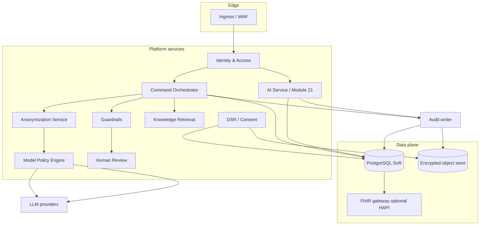
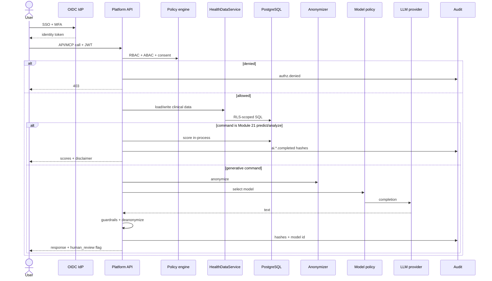

# SynapseMD Enterprise Platform — Architecture and Design

**Document ID:** SYN-ARCH-ENT-001  
**Status:** Complete — Phases A–E shipped. Live staging PITR/rollback remain operator-owned drills.  
**Date:** 2026-08-17  
**Audience:** Engineering, security, compliance, product  
**Companions:** [architecture.md](architecture.md) · [leadership-architecture-brief.md](leadership-architecture-brief.md) · [compliance-controls.md](compliance-controls.md) · [platform/README.md](../platform/README.md) · [enterprise-platform-implementation-plan.md](enterprise-platform-implementation-plan.md)

This document upgrades the **Technical Platform / Platform Layer** from FastAPI rails to an **enterprise-grade** system of record, without collapsing the artifact-driven split: **domain stays markdown; platform stays trust, distribution, and scale.**

**Shipped (Phase A):** PostgreSQL 16 + Alembic, RLS on tenant+user tables, `HealthDataService` adapters (`HEALTH_STORE=json|postgres|dual`), FHIR JSONB projection on write, S3-compatible object store (URI + hash in DB), `POST /admin/migrate` domain upsert, Module 21 Postgres adapter, `command_catalog` seed. Platform persistence for **profile, allergy, and gout**. Local IDE JSON vault is unchanged.

**Shipped (Phase B):** OIDC authorization-code + PKCE, 15-minute access JWT + rotating refresh, IdP group → role map, MFA gate for privileged roles in production, coded PDP, `llm_processing` consent on the LLM path, break-glass, CORS allowlist, password login disabled in staging/prod, MCP JWT-only with secret redaction. SCIM list is tenant-scoped (create remains 501).

**Shipped (Phase C):** OpenTelemetry traces + JSON logs, correlation headers, PHI-free log filter, durable hash-chained `audit_events` (Postgres when `AUDIT_USE_MEMORY=false`), append-only trigger, auditor JSONL export, WORM archive stub. Kafka remains an optional SIEM copy.

**Shipped (Phase D):** Presidio on by default in staging/prod; custom health recognizers; Vault-backed token maps (memory vault forbidden in staging/prod); model catalog + tenant policy + routing decision log; BAA registry table; vLLM BYOM stub; `/ai predict` remains in-process.

**Shipped (Phase E):** DSR access/erase/correct with PHI-free completion certificates; legal hold blocks purge and WORM delete; JWT dual-verify rotation; default-deny NetworkPolicies; specialist worker pool for `/consult`; SCIM user list; HA/PITR and rollback runbooks.

**Not yet shipped:** Live staging restore/rollback drills are operator actions using the runbooks. Do not treat those drills as already executed.

---


## 1. Design goals


| Goal                   | Target                                                                                             |
| ---------------------- | -------------------------------------------------------------------------------------------------- |
| **System of record**   | PostgreSQL (not JSON files) for all tenant health data, identity, audit, and config                |
| **Identity**           | Enterprise SSO (OIDC) + MFA; fine-grained RBAC/ABAC; tenant isolation at the database              |
| **Logging**            | Structured, correlated, PHI-free application logs → SIEM                                           |
| **Audit**              | Append-only, signed, hash-chained, long-retention, queryable, exportable                           |
| **Security**           | Encryption in transit and at rest, secrets in Vault, least privilege, threat-aware defaults        |
| **Anonymization**      | Production-grade NER (Presidio) + KMS-backed token vault; never send raw PHI to LLMs               |
| **Model selection**    | Policy-driven catalog (provider, model, residency, BAA, cost, sensitivity) — not a hardcoded table |
| **Compliance**         | HIPAA technical safeguards, GDPR DSR, SOC 2 evidence hooks, consent as data                        |
| **Preserve artifacts** | Commands / skills / specialists remain markdown; platform executes and constrains them             |


**Non-goals (this design):** Rewriting clinical playbooks in Python; replacing Cursor/Claude local JSON mode for personal use; building a full EHR.

---


## 2. Current state vs target


| Area           | Today                                                                                         | Enterprise target                                                                |
| -------------- | --------------------------------------------------------------------------------------------- | -------------------------------------------------------------------------------- |
| Health storage | Local CLI: `data/*.json`. Platform: Postgres for profile/allergy/gout with FHIR JSONB; other domains still JSON/FHIR files | **PostgreSQL** as SoR for all tenant health data; FHIR JSONB projection; HAPI optional |
| Platform DB    | Postgres 16 + Alembic + RLS (Compose `core`, through `0007_consent_columns`); SQLite + `create_all` for unit tests only | Same + remaining domain tables cloned from the profile/allergy/gout adapter pattern |
| Auth           | Local JWT (dev) + OIDC PKCE/bearer; 15-min access + refresh; MFA `amr` in prod | OIDC SSO (Okta / Entra / Keycloak) + internal JWT; MFA; session/device registry  |
| AuthZ          | Coded PDP (RBAC + consent + purpose + break-glass)   | Same + richer ABAC / policy engine if policies multiply                          |
| Logs           | OpenTelemetry JSON logs + traces; PHI filter; `X-Request-ID` / `X-Trace-ID` | Same + SIEM export of structured logs                          |
| Audit          | Postgres `audit_events` (hash chain, append-only) when `AUDIT_USE_MEMORY=false`; optional Kafka copy; WORM job stub | Same + Object Lock WORM archive; legal hold skips purge |
| Anonymization  | Presidio on in staging/prod; regex + custom MRN/accession/IN phone; Vault tokens (memory forbidden in prod) | Same + richer Presidio recognizers / timeout cache |
| Models         | Catalog + tenant policy + `ModelPolicyEngine`; `ROUTING_TABLE` is hint-only; vLLM stub | BYOM mTLS in prod; richer budget/residency packs |
| Secrets        | `.env`                                               | Vault / cloud KMS; no secrets in ConfigMaps                                      |
| Multi-tenancy  | JWT `tenant_id` + Postgres RLS (`SET LOCAL app.tenant_id` / `app.user_id`) | Same + per-tenant encryption key; network isolation optional |


Personal / IDE mode remains: JSON vault + markdown agents. Enterprise mode is a **different storage adapter** behind the same command names.

---


## 3. Target architecture

```text
┌──────────────┐  ┌──────────────┐  ┌──────────────┐  ┌──────────────┐
│ IDE / CLI    │  │ AnythingLLM  │  │ Open WebUI   │  │ Partner apps │
│ (artifacts)  │  │ MCP SSE      │  │ MCP / bridge │  │ REST         │
└──────┬───────┘  └──────┬───────┘  └──────┬───────┘  └──────┬───────┘
       │                 │                 │                 │
       └─────────────────┴────────┬────────┴─────────────────┘
                                  │  mTLS + JWT
                    ┌─────────────▼─────────────┐
                    │   API Gateway / Ingress   │
                    │  WAF · rate limit · TLS   │
                    └─────────────┬─────────────┘
                                  │
                    ┌─────────────▼─────────────┐
                    │   SynapseMD Platform      │
                    │                           │
                    │  AuthN/Z  Command Orch    │
                    │  Anonymize  Guardrails    │
                    │  Model Policy  RAG        │
                    │  Module 21  Review queue  │
                    └──────┬──────────┬─────────┘
                           │          │
              ┌────────────▼──┐    ┌──▼─────────────┐
              │ PostgreSQL    │    │ Object store   │
              │ SoR + RLS     │    │ reports, WORM  │
              └──────┬────────┘    │ audit archive  │
                     │             └────────────────┘
         ┌───────────┼───────────┐
         ▼           ▼           ▼
    ┌─────────┐ ┌─────────┐ ┌─────────┐
    │ Vault   │ │ IdP     │ │ LLM     │
    │ KMS     │ │ OIDC    │ │ catalog │
    └─────────┘ └─────────┘ └─────────┘
         │
    ┌────▼─────┐  ┌──────────┐  ┌──────────┐
    │ OTel     │→ │ SIEM     │  │ IdP logs │
    │ collector│  │ (audit)  │  │          │
    └──────────┘  └──────────┘  └──────────┘
```


### Layer responsibilities


| Layer                 | Owns                                         | Does not own                                    |
| --------------------- | -------------------------------------------- | ----------------------------------------------- |
| **Gateway**           | TLS, WAF, rate limits, IP allowlists         | Clinical logic                                  |
| **Platform services** | Auth, orchestration, PHI, models, audit APIs | Command markdown content                        |
| **Data plane**        | Postgres, object store, FHIR export          | Agent filesystem tools                          |
| **Control plane**     | Tenant config, model policy, consent, keys   | Per-disease scoring formulas (except Module 21) |
| **Domain artifacts**  | Commands, skills, specialists                | Encryption, tenancy, SSO                        |


---


## 4. Logical components




Keep **one orchestrator** for REST and MCP (already true in `mcp/dispatch.py`). Enterprise work hardens that path; it does not add a second clinical brain.

---


## 5. Data architecture — PostgreSQL as system of record


### 5.1 Principles

1. **Postgres is authoritative** for identity, clinical records, AI history, audit, consent, and model policy.
2. **JSON files are an adapter**, not SoR, in enterprise deployments (import/export and local IDE only).
3. **FHIR R4 is the interchange format** (export, partner EHR, SMART-on-FHIR later) — stored as JSONB **and** projected from domain tables.
4. **Every clinical row is tenant-scoped.** RLS is mandatory, not optional.
5. **Encryption:** disk/volume encryption + column encryption for high-sensitivity fields using per-tenant KMS keys.


### 5.2 Schema domains


| Schema / area | Tables (illustrative)                                                                           | Notes                                                           |
| ------------- | ----------------------------------------------------------------------------------------------- | --------------------------------------------------------------- |
| `iam`         | `tenants`, `users`, `identities`, `roles`, `permissions`, `sessions`, `api_keys`                | SSO subject IDs; no raw email at rest (hash + encrypted lookup) |
| `clinical`    | `patients`, `encounters`, `observations`, `allergies`, `medications`, `conditions`, `documents` | Typed tables for query; `resource_json jsonb` FHIR overlay      |
| `trackers`    | `gout_flares`, `sleep_sessions`, `nutrition_logs`, …                                            | 1:1 with today’s JSON trackers; written by command APIs         |
| `ai`          | `ai_interactions`, `ai_configs`, `prediction_runs`, `review_queue`                              | Hashes of prompts/responses; no raw PHI                         |
| `governance`  | `consents`, `purpose_of_use`, `dsr_requests`, `baa_records`                                     | Legal basis for processing / LLM                                |
| `models`      | `model_catalog`, `tenant_model_policies`, `routing_decisions_log`                               | Flexible model selection                                        |
| `audit`       | `audit_events` (append-only)                                                                    | Hash chain; partitioned by month                                |


### 5.3 Tenant isolation (RLS)

On **every** tenant table:

```sql
ALTER TABLE clinical.observations ENABLE ROW LEVEL SECURITY;
CREATE POLICY tenant_isolation ON clinical.observations
  USING (tenant_id = current_setting('app.tenant_id')::uuid)
  WITH CHECK (tenant_id = current_setting('app.tenant_id')::uuid);
```

Request middleware sets `SET LOCAL app.tenant_id` / `app.user_id` / `app.roles` inside the transaction. Platform DB role **cannot** bypass RLS except a break-glass auditor role (logged).

### 5.4 Health data service (replaces file I/O on the platform path)

```text
Command / MCP / AI
        │
        ▼
 HealthDataService
        │
        ├── write domain row (typed)
        ├── upsert FHIR JSONB projection
        ├── update search index (optional)
        └── emit audit event
```

Local CLI continues to use `data/*.json` via `LegacyJsonAdapter`. Enterprise uses `PostgresHealthAdapter`. Same command names.

### 5.5 Object store

Use S3-compatible encrypted buckets (SSE-KMS, per-tenant prefix):

- Lab PDFs / images (today under `data/biochemical-tests/.../images`)
- Generated HTML reports
- Audit WORM archive (Object Lock / compliance mode)
- FHIR bulk export files (time-limited, encrypted)

Postgres stores **pointers + hashes**, not blobs.

### 5.6 Migration

1. Alembic from current SQLAlchemy models.
2. `POST /admin/migrate` already maps JSON → FHIR — extend to **upsert Postgres domain tables**.
3. Dual-read (Postgres first, JSON fallback) for one release.
4. Dual-write off; JSON becomes export-only.

---


## 6. Authentication and authorization


### 6.1 Authentication


| Mechanism             | Use                                                                            |
| --------------------- | ------------------------------------------------------------------------------ |
| **OIDC SSO**          | Primary for clinicians/admins (Okta, Entra ID, Keycloak)                       |
| **MFA**               | Required for `clinician`, `admin`, `auditor` (enforced at IdP)                 |
| **Internal JWT**      | Short-lived (15 min) access + rotating refresh (or BFF session cookie)         |
| **Workload identity** | MCP/API service accounts via mTLS or SPIFFE — not long-lived PATs in chat logs |
| **SCIM**              | Optional user/group provisioning from IdP                                      |


Stop treating local email/password as production auth. Keep it only for `APP_ENV=development`.

Token claims (minimum):

```json
{
  "sub": "user-uuid",
  "org": "tenant-uuid",
  "roles": ["clinician"],
  "scope": ["read:own", "write:own", "read:org"],
  "purpose": "treatment",
  "amr": ["pwd", "mfa"],
  "sid": "session-id"
}
```


### 6.2 Authorization

Two layers:

1. **RBAC** — roles as today, plus `tenant_admin`, `privacy_officer`, `break_glass`.
2. **ABAC / policy** — evaluated per request:


| Attribute      | Example rule                               |
| -------------- | ------------------------------------------ |
| Purpose of use | `treatment` vs `research` vs `operations`  |
| Consent        | LLM processing allowed? Org RAG opt-in?    |
| Resource owner | Patient can only `read:own` / `write:own`  |
| Break-glass    | Time-boxed elevation; extra audit + notify |
| Data class     | De-identified vs PHI vs credentials        |


Implement as a small **Policy Decision Point** (start with in-process Cedar/OPA subset or coded policies; do not scatter `if role ==` across routes).

### 6.3 MCP / chat UI

- Chat UIs never hold GitLab-style PATs or cloud LLM keys.  
- User JWT (or token exchange) is the only credential.  
- Tool allowlists stay server-side (`PLATFORM_COMMANDS` / `command_catalog` + policy).

---


## 7. Enterprise logging (not audit)

**Logs** are for operations. **Audit** is for compliance. Keep them separate.

### 7.1 Application logs

- JSON logs via OpenTelemetry (`service.name`, `trace_id`, `span_id`, `tenant_id`, `user_id` **as UUID only**)
- **Deny-list PHI** in log formatters (no names, emails, lab values, prompts, completions)
- Log: route, status, latency, command name, model id, guardrail outcome, error class
- Do **not** log raw request bodies on clinical routes


### 7.2 Tracing and metrics

- OTel traces across API → orchestrator → LLM HTTP → Postgres  
- Metrics (existing + new): auth failures, RLS denials, anonymization failures, model policy denials, DSR SLA, review-queue age  
- Alerting: [docs/runbooks/alerting.md](runbooks/alerting.md) extended for auth spike, PHI-block spike, audit-write failure (page)


### 7.3 SIEM

Ship logs and audit **copies** to customer SIEM (Splunk / Sentinel / Chronicle) over TLS. Platform retains audit SoR in Postgres + WORM.

---


## 8. Auditing


### 8.1 What must be audited


| Event class | Examples                                                                |
| ----------- | ----------------------------------------------------------------------- |
| AuthN       | login, SSO, MFA fail, token revoke                                      |
| AuthZ       | denied access, break-glass                                              |
| Data        | read/write/export/erase of clinical rows                                |
| AI          | command executed/blocked; model id; prompt/response **hashes**; latency |
| Admin       | tenant settings, model policy change, key rotation                      |
| DSR         | export/erasure request and completion                                   |


### 8.2 Integrity

- **Append-only** table; no `UPDATE`/`DELETE` for application roles  
- HMAC or KMS signature per event (already sketched)  
- **Hash chain:** `prev_hash` + payload → `event_hash` (tamper evidence)  
- Partition by `created_at`; monthly roll to WORM object store  
- Retention: default 6 years (HIPAA); tenant-configurable; **legal hold** flag skips purge


### 8.3 Query

Auditors use `GET /admin/audit` with filters (time, user, event_type, command) — never a shared memory list. Export as JSONL for regulators.

---


## 9. Security architecture


| Control                | Design                                                                                       |
| ---------------------- | -------------------------------------------------------------------------------------------- |
| **TLS**                | 1.2+ (prefer 1.3) everywhere; HSTS; no mixed content                                         |
| **mTLS**               | Service-to-service (API ↔ MCP, API ↔ HAPI)                                                   |
| **Secrets**            | Vault / cloud secret manager; rotate JWT signing keys                                        |
| **Encryption at rest** | Volume encryption + per-tenant DEK wrapped by KMS CMK                                        |
| **Network**            | Private subnets; egress allowlist to LLM providers only                                      |
| **Supply chain**       | Pin deps, SBOM, image scan, signed images                                                    |
| **App security**       | Parameterized SQL, RLS, CSRF on cookie BFF, strict CORS (drop `allow_origins=["*"]` in prod) |
| **Threat detection**   | Anomalous export volume, repeated 403s, unusual model-policy bypass                          |
| **Backup**             | Encrypted PITR (Postgres); tested restore runbook; tenant-scoped restore                     |


Production **must not** use `jwt_secret=change-me-in-production` or debug SQL echo.

---


## 10. Anonymization and PHI handling


### 10.1 Pipeline (mandatory before any external LLM)

```text
Clinical context (Postgres)
        │
        ▼
 Purpose + consent check
        │
        ▼
 Anonymization Service
   - Presidio NER + custom health recognizers
   - Stable tokens: [PERSON_1], [DATE_1], [MRN_1]
   - Token map encrypted in Vault under tenant DEK
        │
        ▼
 Model Policy Engine (may refuse if BAA/residency fail)
        │
        ▼
 LLM provider
        │
        ▼
 Guardrails
        │
        ▼
 Deanonymize for authorized user only
        │
        ▼
 Audit hashes (never raw prompt)
```


### 10.2 Rules

- `APP_ENV` in `staging`/`production`: Presidio **on**; `phi_block_on_failure=true`  
- Module 21 **local scoring** may use identified data **in-process** (same trust boundary as DB) but still must not log PHI  
- Chat UIs receive deanonymized text only over the authenticated session  
- Re-identification is an audited `purpose=treatment` action, not a debug flag


### 10.3 Data classification


| Class    | Examples                          | LLM                       |
| -------- | --------------------------------- | ------------------------- |
| Public   | Clinical guidelines in RAG        | Allowed                   |
| Internal | Org protocols (opt-in RAG)        | Allowed if tenant consent |
| PHI      | Names, MRN, labs tied to identity | Anonymize or local-only   |
| Secrets  | API keys, tokens                  | Never in prompts or logs  |


---


## 11. Flexible model selection

Replace the hardcoded `ROUTING_TABLE` with a **catalog + policy**.

### 11.1 Model catalog (DB)


| Field                       | Purpose                                                      |
| --------------------------- | ------------------------------------------------------------ |
| `provider`                  | anthropic, openai, google, azure_openai, bedrock, vllm, mock |
| `model_id`                  | e.g. `claude-sonnet-4-6`                                     |
| `capabilities`              | chat, json, vision, long-context                             |
| `baa_required`              | boolean                                                      |
| `data_residency`            | us, eu, in, on-prem                                          |
| `max_tokens`, `cost_per_1k` | routing / budget                                             |
| `safety_tier`               | standard, health, critical                                   |
| `enabled`                   | global kill switch                                           |


### 11.2 Tenant policy

Tenants (and optionally orgs) set:

- Allowed providers / models  
- Default model  
- Pin `consult` / `specialist` to `safety_tier=critical`  
- Require `baa_signed=true`  
- Residency lock (e.g. EU-only)  
- Monthly token budget  
- BYOM endpoint (vLLM / Azure) with mTLS


### 11.3 Decision function

```text
route(command, data_class, tenant_policy, catalog) →
  model, provider, temperature, require_human_review, fallback
```

Still use command complexity (`consult` = critical) as an **input**, not the only input. Log every routing decision to `routing_decisions_log` (model id, reason codes: `baa`, `residency`, `budget`, `fallback`).

### 11.4 Module 21

Keep **deterministic scoring in-process**. Do not send `/ai predict` to an external LLM unless policy explicitly allows a “narrative overlay” after scoring — and then only on anonymized summaries.

---


## 12. Compliance and privacy operations

Map controls to running systems (extends [compliance-controls.md](compliance-controls.md)):


| Framework           | Platform capability                                                                                   |
| ------------------- | ----------------------------------------------------------------------------------------------------- |
| **HIPAA**           | Access control, audit, integrity (hash chain), TLS, encryption at rest, BAA registry                  |
| **GDPR**            | Consent records, export (FHIR + domain JSON), erasure (clinical + objects + tokens), portability, DPA |
| **SOC 2**           | SSO/MFA, change management evidence, monitoring, incident runbooks                                    |
| **Clinical safety** | Guardrails, disclaimers, human review SLA ([slo.md](slo.md))                                          |


### DSR workflow

1. Privacy officer opens `dsr_requests` (access / erase / correct).
2. Job exports or deletes: Postgres rows, object prefixes, Vault tokens, RAG org docs if any.
3. Audit + legal hold check.
4. Certificate of completion stored (no PHI in the certificate).


### Consent

Persist: ToS version, LLM processing, org-RAG, research, marketing (default off). Orchestrator **refuses** LLM if `llm_processing` consent is false.

---


## 13. Request path (enterprise)




---


## 14. Deployment topology


| Environment | Auth              | DB                                   | LLM                 | Notes                  |
| ----------- | ----------------- | ------------------------------------ | ------------------- | ---------------------- |
| **dev**     | local JWT         | SQLite or local Postgres             | mock                | Fast inner loop        |
| **staging** | IdP (test tenant) | Postgres                             | mock or BAA sandbox | Prod-like RLS/Presidio |
| **prod**    | IdP + MFA         | HA Postgres (primary + sync replica) | catalog-gated       | WORM audit, no debug   |


Kubernetes (already stubbed under `deploy/k8s/`):

- API + MCP deployments, HPA on CPU/RPS  
- Postgres operator or managed RDS/Cloud SQL  
- Vault agent injector  
- OTel collector DaemonSet  
- NetworkPolicies default-deny

Compose `full` profile remains for laptop demos — **not** a production topology.

---


## 15. What stays artifact-driven

Enterprise hardening **must not** require SMEs to write Python for new specialties.


| Still markdown      | Platform contract                                                                       |
| ------------------- | --------------------------------------------------------------------------------------- |
| `commands/*.md`     | Registered in command catalog table (id, sensitivity, scopes)                           |
| `skills/*/SKILL.md` | Invoked by orchestrator/agent; data via HealthDataService                               |
| `specialists/*.md`  | IDE: Task fan-out; platform: CRITICAL model + review (or future specialist worker pool) |


Gap to close later (not blocking DB/auth): platform `/consult` still does **not** spawn parallel specialist subagents. Treat as a **phase 2 runtime** feature (worker queue + specialist prompts), not a storage prerequisite.

---


## 16. Phased delivery


### Phase A — Data plane (foundation)

**Shipped:** Postgres + Alembic; RLS + `SET LOCAL` on tenant+user tables; `HealthDataService` for profile / allergy / gout; `HEALTH_STORE` flag; FHIR JSONB on write; object-store URI + hash; migrate upsert; AI adapter on Postgres; command catalog; Compose `core` + CI Postgres.


### Phase B — Identity and access

**Shipped:** OIDC authorization-code + PKCE and JWT bearer exchange; 15-minute access JWT + rotating refresh; IdP group → role map; MFA `amr` gate in production; coded PDP; `llm_processing` consent; break-glass; CORS allowlist; password login off in staging/prod; MCP JWT-only with redaction. SCIM list/create is a stub (full provisioning can move to E).


### Phase C — Observability and audit

**Shipped:** OTel traces + JSON PHI-free logs; correlation headers; durable hash-chained `audit_events`; append-only DB trigger; auditor filter + JSONL export; Prometheus counters and alert rules; WORM archive stub (skips on legal hold). Kafka/SIEM remains optional. Native monthly RANGE partitions are deferred; `partition_month` + indexes are in place.


### Phase D — PHI and models

**Shipped:** Presidio default in staging/prod; custom recognizers; durable token vault required in prod; catalog + tenant policy + BAA registry; routing decisions audited (`ai.routing.decided`); vLLM provider stub; Module 21 predict never calls an LLM.


### Phase E — Privacy ops and HA

**Shipped:** `dsr_requests` access/erase/correct with PHI-free certificates; `legal_holds` skip erase and WORM archive; JWT `JWT_SECRET_PREVIOUS` dual-verify; default-deny NetworkPolicies with HTTPS LLM egress; in-process specialist worker pool for platform `/consult`; SCIM list from tenant users; HA/PITR and rollback runbooks plus engagement packet index. Live staging PITR/rollback drills remain operator-owned.

Each phase needs: threat notes, test plan (tenant isolation, PHI-in-logs negative tests), and compliance evidence update.

**Detailed work items, tests, and exit criteria:** [enterprise-platform-implementation-plan.md](enterprise-platform-implementation-plan.md).

---


## 17. Open decisions (product / security)


| Decision                       | Options                       | Recommendation                                              |
| ------------------------------ | ----------------------------- | ----------------------------------------------------------- |
| FHIR SoR vs projection         | HAPI as SoR vs Postgres JSONB | **Postgres SoR + FHIR projection**; HAPI optional for SMART |
| Policy engine                  | Coded PDP vs OPA/Cedar        | **Coded PDP first**; OPA if policies multiply               |
| Session style                  | SPA JWT vs BFF cookies        | **BFF cookies** for browser UIs; JWT for MCP/API            |
| Specialist fan-out on platform | Generic LLM vs worker pool    | Worker pool in Phase E                                      |
| Multi-region                   | Active-active vs primary + DR | **Single-region + DR** until residency requires split       |


---


## 18. Success criteria

Enterprise-grade means we can demonstrate:

1. A clinician logs in via SSO+MFA and only sees their tenant’s patients.
2. Clinical writes land in Postgres (not `data/*.json`) and survive pod restart.
3. An LLM call cannot proceed if anonymization fails or BAA/residency policy fails.
4. Logs in the aggregator contain **no** names, MRNs, or lab values.
5. An auditor exports a signed, hash-chained event trail for a date range.
6. A tenant admin can pin `consult` to a specific model and forbid non-BAA providers.
7. Erasure removes DB rows, object prefixes, and token maps, with an audit certificate.
8. SMEs still add a command/skill/specialist as markdown without a platform rewrite.

---

*This design upgrades the Technical Platform / Platform Layer. Domain artifacts remain the product catalog. Implementation should follow the phases above; do not mix local JSON SoR into production tenants.*