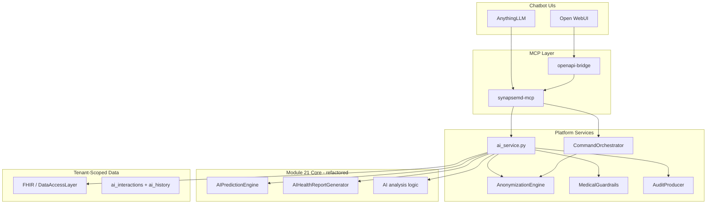

# Platform AI Integration & Release Readiness Plan

**Project:** SynapseMD  
**Created:** 2026-07-04  
**Scope:** (a) Wire Module 21 AI into platform/MCP, (b) Complete release gates, (c) Maintain ≥95% test coverage  
**References:**
- [AI_FEATURES_IMPLEMENTATION_SUMMARY.md](AI_FEATURES_IMPLEMENTATION_SUMMARY.md) — Module 21 CLI status
- [../docs/release-gates.md](../docs/release-gates.md) — Pre-release checklist
- [../docs/ui-mcp-integration.md](../docs/ui-mcp-integration.md) — MCP/UI contract
- [../docs/implementation-roadmap.md](../docs/implementation-roadmap.md) — Platform phases
- [todo/21-ai-features.md](todo/21-ai-features.md) — Module 21 requirements

---

## Current State Summary

| Area | Status |
|------|--------|
| Module 21 CLI (`/ai`, scripts, skill) | Implemented for local Claude Code workflow |
| Enterprise platform (`platform/`) | Scaffold complete; MCP + Docker/K8s in place |
| Module 21 ↔ platform integration | **Not connected** — `ai` missing from `AVAILABLE_COMMANDS` |
| Release gates (`docs/release-gates.md`) | **0 / 33 items checked** |
| Platform test coverage | **96.18%** (113 tests, threshold 95% in root `pyproject.toml`) |

**Gap:** Two parallel AI stacks exist. This plan unifies them and drives production readiness.

---

## Architecture Target



**Principle:** Refactor `scripts/ai_prediction.py` and `scripts/generate_ai_report.py` into importable platform services. CLI scripts become thin wrappers; MCP/API become first-class entry points.

---

## Phase A — Wire Module 21 into Platform / MCP

**Goal:** Expose `/ai analyze|predict|chat|report|status` through API, MCP, and orchestrator with PHI safety and audit.

**Estimated effort:** 2–3 weeks

### A1. Refactor Module 21 into platform package

| Task | Details | Files |
|------|---------|-------|
| A1.1 Create `ai/` package | Move core logic from scripts into testable modules | `platform/synapsemd_platform/ai/` |
| A1.2 Extract prediction engine | Port `AIPredictionEngine` from `scripts/ai_prediction.py` | `ai/prediction.py` |
| A1.3 Extract report generator | Port `AIHealthReportGenerator` from `scripts/generate_ai_report.py` | `ai/report.py` |
| A1.4 Extract analyzer | Multi-dimensional analysis (correlation, trend, anomaly) | `ai/analyzer.py` |
| A1.5 Pydantic schemas | Request/response models for all AI actions | `ai/schemas.py` |
| A1.6 Thin CLI wrappers | Keep `scripts/*.py` calling platform modules for backward compat | `scripts/ai_prediction.py`, `scripts/generate_ai_report.py` |

**Acceptance criteria:**
- [ ] Platform package imports AI modules without `sys.path` hacks
- [ ] Existing `scripts/test-ai-features.sh` still passes (or updated equivalently)
- [ ] No duplicate business logic between scripts and platform

### A2. Tenant-scoped data layer for AI

| Task | Details | Files |
|------|---------|-------|
| A2.1 Data adapter | Read health data from FHIR bundle + legacy JSON migration path | `ai/data_adapter.py` |
| A2.2 Config per tenant | Replace global `data/ai-config.json` with tenant settings (DB or FHIR Observation) | `core/config.py`, `models/` |
| A2.3 History persistence | Store analysis/prediction results in `ai_interactions` table | `models/audit.py`, `ai/history.py` |
| A2.4 Setup script update | Extend `scripts/setup-data.sh` to seed AI config template | `scripts/setup-data.sh` |

**Acceptance criteria:**
- [ ] AI operations scoped by `{tenant_id, user_id}`
- [ ] No cross-tenant reads in AI data adapter (negative test required)
- [ ] `data/ai-config.json` remains optional for local-only CLI dev

### A3. AI service layer (PHI-safe orchestration)

| Task | Details | Files |
|------|---------|-------|
| A3.1 `AIService` facade | Single entry: `analyze`, `predict`, `chat`, `report`, `status` | `services/ai_service.py` |
| A3.2 PHI anonymization | Run all user text through `AnonymizationEngine` before LLM | Reuse `anonymization/engine.py` |
| A3.3 Guardrails | Apply `MedicalGuardrails` to all AI text outputs | Reuse `governance/guardrails.py` |
| A3.4 Audit | Emit `ai.command.executed` / `ai.analyze.completed` events | `audit/events.py` |
| A3.5 Human review queue | Queue Level 3 / high-risk predictions | `models/review.py`, `governance/guardrails.py` |
| A3.6 Disclaimers | Append standard medical disclaimer to all AI responses | Align with `commands/ai.md` |

**Acceptance criteria:**
- [ ] Every AI action produces audit record with prompt/response hashes (no raw PHI)
- [ ] High-risk predictions trigger `human_review_required=true`
- [ ] Blocked guardrail responses return safe fallback text

### A4. API routes

| Task | Details | Files |
|------|---------|-------|
| A4.1 Add `ai` router | REST endpoints mirroring `/ai` actions | `api/routes/ai.py` |
| A4.2 Register routes | Mount at `/api/v1/ai/` | `api/main.py` |
| A4.3 Add to command list | Include `ai` in `AVAILABLE_COMMANDS` | `api/routes/commands.py` |
| A4.4 API schemas | `AiAnalyzeRequest`, `AiPredictRequest`, etc. | `api/schemas.py` |

**Endpoint map:**

| CLI | API | Method |
|-----|-----|--------|
| `/ai analyze [range]` | `/api/v1/ai/analyze` | POST |
| `/ai predict <type>` | `/api/v1/ai/predict` | POST |
| `/ai chat <query>` | `/api/v1/ai/chat` | POST |
| `/ai report generate` | `/api/v1/ai/report` | POST |
| `/ai status` | `/api/v1/ai/status` | GET |

**Acceptance criteria:**
- [ ] All 5 actions reachable via authenticated API
- [ ] OpenAPI docs show AI endpoints at `/docs`
- [ ] 401/403 enforced per RBAC scope

### A5. MCP tools

| Task | Details | Files |
|------|---------|-------|
| A5.1 New MCP tools | `ai_analyze`, `ai_predict`, `ai_chat`, `ai_report`, `ai_status` | `mcp/tools.py`, `mcp/server.py` |
| A5.2 MCP schemas | Strict input/output models | `mcp/schemas.py` |
| A5.3 OpenAPI bridge | Mirror tools in `deploy/openapi-bridge/bridge.py` | `deploy/openapi-bridge/` |
| A5.4 Update docs | Extend tool contract table | `docs/ui-mcp-integration.md` |

**Acceptance criteria:**
- [ ] AnythingLLM can invoke all 5 AI tools via MCP
- [ ] Open WebUI can invoke same tools via OpenAPI bridge
- [ ] MCP tools call `AIService`, not scripts directly

### A6. Command orchestrator integration

| Task | Details | Files |
|------|---------|-------|
| A6.1 Route `command=ai` | Delegate to `AIService` with payload `{action, target, options}` | `services/command_orchestrator.py` |
| A6.2 LLM router mapping | Keep `ai` as COMPLEX command in router | `llm/router.py` |
| A6.3 RAG enrichment | Optional clinical KB context for `ai chat` | `rag/retrieval.py` |

**Acceptance criteria:**
- [ ] `POST /api/v1/commands/execute` with `command: "ai"` works
- [ ] MCP `execute_command` with `command: "ai"` works

### A7. Documentation & CLI parity

| Task | Details | Files |
|------|---------|-------|
| A7.1 Update AI summary | Split "CLI ready" vs "Platform ready" sections | `mydocs/AI_FEATURES_IMPLEMENTATION_SUMMARY.md` |
| A7.2 Platform README | Document AI API + MCP usage | `platform/README.md` |
| A7.3 Keep CLI commands | Ensure `commands/ai.md` references platform paths where applicable | `commands/ai.md` |

---

## Phase B — Complete Release Gates

**Goal:** Check off all items in [docs/release-gates.md](../docs/release-gates.md) with evidence.

**Estimated effort:** 3–4 weeks (can overlap Phase A)

Track progress by updating checkboxes in `docs/release-gates.md` as each item is verified.

### B1. PHI Safety (5 items)

| Gate | Implementation task | Verification |
|------|---------------------|--------------|
| Presidio in non-dev | Enable in staging/prod ConfigMap; add `[presidio]` to Docker image | `PRESIDIO_ENABLED=true` in `deploy/k8s/overlays/production/` |
| PHI block on failure | Confirm default + staging override | Config + unit test |
| No PHI in logs/audit | Log scrubber middleware; audit stores hashes only | Code review + `tests/release/test_phi_safety.py` |
| Vault/KMS for tokens | Wire `VaultClient` into `AnonymizationEngine` token store | Integration test with Vault dev container |
| PHI leakage tests pass | Expand golden PHI strings test suite | CI green on `tests/release/` |

**Deliverables:**
- [ ] `platform/synapsemd_platform/anonymization/vault_store.py`
- [ ] `docs/runbooks/phi-handling.md`

### B2. Tenant Isolation (4 items)

| Gate | Implementation task | Verification |
|------|---------------------|--------------|
| JWT tenant on all calls | Audit MCP + AI routes for `get_request_ctx` | Static review + tests |
| Cross-tenant negative tests | Add FHIR + RAG + AI cross-tenant tests | `tests/release/test_tenant_isolation.py` |
| Org RAG tenant-scoped | Confirm `include_org_intelligence` default false in prod | Config + test |
| PostgreSQL RLS | Validate `001_rls.sql` applied in Compose + K8s init | Migration smoke test |

**Deliverables:**
- [ ] `tests/release/test_ai_tenant_isolation.py` (new, Phase A dependency)
- [ ] RLS validation script or integration test

### B3. Clinical Safety (4 items)

| Gate | Implementation task | Verification |
|------|---------------------|--------------|
| Guardrails block diagnostics | Existing + extend for AI outputs | `tests/unit/test_llm_and_guardrails.py` |
| High-risk commands → review | Enforce in prod ConfigMap for `consult`, `mental-health`, `ai predict` | E2E test |
| Emergency disclaimers | Low-confidence + AI responses | Orchestrator + AIService tests |
| Review queue operational | Clinician decide flow end-to-end | `tests/integration/test_api.py` + manual QA |

**Deliverables:**
- [ ] `docs/clinical-safety-policy.md`

### B4. LLM Provider Readiness (4 items)

| Gate | Implementation task | Verification |
|------|---------------------|--------------|
| BAA signed per provider | Track in config + secret management | `*_BAA_SIGNED` env vars |
| Provider routing per env | Staging=mock, prod=anthropic/openai/google | Kustomize overlays |
| Fallback path tested | Already partially tested | `tests/unit/test_production_modules.py` |
| Model eval harness | **New:** golden prompt regression suite | `tests/eval/` |

**Deliverables:**
- [ ] `tests/eval/golden_prompts.yaml`
- [ ] `tests/eval/test_model_regression.py`
- [ ] `docs/baa-tracking.md`

### B5. Observability & SLOs (4 items)

| Gate | Implementation task | Verification |
|------|---------------------|--------------|
| Health/metrics monitored | Prometheus scrape config in K8s | `deploy/k8s/base/` ServiceMonitor or docs |
| SLOs defined | Document targets | `docs/slo.md` |
| Kafka audit in staging/prod | `AUDIT_USE_KAFKA=true` in overlays | Redpanda/MSK integration test |
| Alerting | Alert rules for guardrail blocks, review backlog | `deploy/k8s/base/prometheus-rules.yaml` or runbook |

**Deliverables:**
- [ ] `docs/slo.md`
- [ ] `docs/runbooks/alerting.md`

### B6. Operations (6 items)

| Gate | Implementation task | Verification |
|------|---------------------|--------------|
| DB backup/restore drill | Document + execute once | `docs/runbooks/backup-restore.md` |
| Secret rotation runbook | JWT, Vault, LLM keys | `docs/runbooks/secret-rotation.md` |
| Incident response playbook | | `docs/runbooks/incident-response.md` |
| Rollback tested | API + MCP K8s rollback procedure | Drill log in `mydocs/ops-log.md` |
| Docker Compose validated | Run all profiles, document results | `platform/docker-compose.profiles.md` |
| K8s overlays validated | `kubectl apply -k` on staging cluster | `deploy/k8s/README.md` |

### B7. Compliance (5 items)

| Gate | Implementation task | Verification |
|------|---------------------|--------------|
| HIPAA mapping complete | Extend `docs/compliance-controls.md` with evidence links | Doc review |
| SOC 2 evidence process | Define artifact collection | `docs/compliance/soc2-evidence.md` |
| Consent flow documented | Org RAG + LLM consent | `docs/consent-flow.md` |
| Export/erasure endpoints | Implement `/admin/export/{user_id}`, soft-delete | `api/routes/admin.py` |
| External audit scheduled | Business/process item | Record date in compliance doc |

### B8. UI Integration (4 items)

| Gate | Implementation task | Verification |
|------|---------------------|--------------|
| MCP contract documented | Already done; extend for AI tools | `docs/ui-mcp-integration.md` |
| AnythingLLM validated | Manual test checklist | `mydocs/qa/anythingllm-validation.md` |
| Open WebUI bridge validated | Manual test checklist | `mydocs/qa/openwebui-validation.md` |
| UI PHI boundary | Document what UI stores vs platform | `docs/ui-mcp-integration.md` § Security |

---

## Phase C — Test Coverage ≥95%

**Goal:** Maintain ≥95% line coverage on `synapsemd_platform` as Phase A/B add code. Raise quality bar for Module 21 integration.

**Current baseline:** 113 tests, **96.18%** coverage (root `pyproject.toml` enforces `--cov-fail-under=95`).

### C1. Coverage policy

| Rule | Detail |
|------|--------|
| Scope | `platform/synapsemd_platform/` (via root pytest config) |
| Threshold | **≥95%** — CI must fail below this |
| New code | Every new module in Phase A requires unit tests before merge |
| Omit list | Review omit entries; prefer testing over omitting as modules mature |

**Current omits (review in Phase C):**

```
platform/synapsemd_platform/models/user.py
platform/synapsemd_platform/mcp/server.py
platform/synapsemd_platform/audit/kafka_sink.py
platform/synapsemd_platform/fhir/hapi_client.py
platform/synapsemd_platform/core/vault.py
```

**Target:** Reduce omits to zero (or only `TYPE_CHECKING` / `if __name__`) by adding integration tests with mocks.

### C2. Test structure (after Phase A)

```
tests/
├── unit/           # Fast, isolated (existing + ai/*)
├── integration/    # API routes including /ai/*
├── e2e/            # Full tenant → AI analyze → audit flow
├── release/        # PHI safety, tenant isolation, gate verification
└── eval/           # Golden prompt / model regression (Phase B4)
```

### C3. Required tests for Module 21 integration

| Module | Test file | Min scenarios |
|--------|-----------|---------------|
| `ai/prediction.py` | `tests/unit/test_ai_prediction.py` | 5 risk types, missing data, edge BMI/age |
| `ai/report.py` | `tests/unit/test_ai_report.py` | HTML output, empty data, report types |
| `ai/analyzer.py` | `tests/unit/test_ai_analyzer.py` | Correlation, trend, anomaly detection |
| `services/ai_service.py` | `tests/unit/test_ai_service.py` | All 5 actions, PHI block, guardrail block |
| `api/routes/ai.py` | `tests/integration/test_ai_api.py` | Auth, 422, success paths |
| `mcp/tools.py` (AI) | `tests/unit/test_mcp_ai.py` | Each MCP AI tool |
| Tenant isolation | `tests/release/test_ai_tenant_isolation.py` | Cross-tenant AI data access denied |

### C4. Coverage hotspots to address (current)

| File | Coverage | Action |
|------|----------|--------|
| `llm/providers.py` | 90% | Test remaining provider error paths |
| `mcp/context.py` | 71% | Test tenant override mismatch, missing token |
| `mcp/tools.py` | 96% | Cover unknown command + resource_type filter |
| `audit/events.py` | 95% | Test Kafka path with mock producer |
| `api/routes/admin.py` | 79% | Cover review decide success + migrate edge cases |
| `api/routes/auth.py` | 81% | Cover login failure, invalid role |

### C5. CI enforcement

| Step | Command | Gate |
|------|---------|------|
| Unit + integration | `pytest -v` | All pass |
| Coverage | `--cov-fail-under=95` | ≥95% |
| Lint | `ruff check platform/synapsemd_platform tests` | Zero errors |
| Release tests | `pytest tests/release/ tests/eval/` | All pass |
| Module 21 CLI (optional job) | `./scripts/test-ai-features.sh` | Backward compat |

Update `.github/workflows/platform-ci.yml` to include:
- [ ] `tests/release/` job
- [ ] `tests/eval/` job (after Phase B4)
- [ ] Coverage report artifact upload

### C6. Acceptance criteria (Phase C)

- [ ] Coverage ≥95% after all Phase A modules merged
- [ ] No new modules added without corresponding tests
- [ ] Omit list reduced from 5 entries to ≤2
- [ ] AI integration adds ≥25 new tests
- [ ] CI fails on coverage regression

---

## Execution Timeline

| Week | Focus | Exit criteria |
|------|-------|---------------|
| 1 | A1–A2: Refactor AI into platform + data adapter | Importable `ai/` package, tenant-scoped reads |
| 2 | A3–A4: AIService + API routes | 5 AI endpoints live, audited |
| 3 | A5–A6: MCP + orchestrator | MCP AI tools work in AnythingLLM |
| 4 | C3: AI test suite | ≥25 new tests, coverage ≥95% |
| 5 | B1–B2: PHI + tenant gates | 9 release gate items checked |
| 6 | B3–B4: Clinical + LLM gates | Eval harness + 8 more items checked |
| 7 | B5–B6: Ops + observability | Runbooks + 10 more items checked |
| 8 | B7–B8: Compliance + UI QA | All 33 release gates checked |

Phases A and B can run in parallel after Week 2 (API contract stable).

---

## Dependencies & Risks

| Risk | Mitigation |
|------|------------|
| `scripts/ai_prediction.py` is monolithic (~687 lines) | Incremental extract; keep CLI wrapper until parity proven |
| `data/*` gitignored — no AI config in repo | Ship `data/templates/ai-config.json`; setup script copies to user data dir |
| Dual AI paths during migration | Feature flag `AI_PLATFORM_ENABLED`; CLI falls back to scripts until flag on |
| Coverage drop when adding AI modules | Write tests alongside each A1–A5 task (Phase C3 checklist) |
| Presidio/Vault/Kafka need running infra | Use Docker Compose `full` profile for integration tests |
| BAA / external audit are process items | Track separately; do not block code merge on business sign-off |

---

## Definition of Done

The plan is complete when:

1. **(a)** All 5 `/ai` actions work via API, MCP, and `execute_command`; Module 21 logic lives in `platform/synapsemd_platform/ai/`.
2. **(b)** All 33 checkboxes in [docs/release-gates.md](../docs/release-gates.md) are checked with linked evidence (tests, runbooks, or QA logs).
3. **(c)** CI enforces ≥95% coverage with ≥138 total tests (113 current + 25 new minimum); omit list reduced.

---

## Quick Reference — Key Files to Create/Modify

**Create:**
- `platform/synapsemd_platform/ai/` (prediction, report, analyzer, schemas, data_adapter, history)
- `platform/synapsemd_platform/services/ai_service.py`
- `platform/synapsemd_platform/api/routes/ai.py`
- `tests/unit/test_ai_*.py`, `tests/integration/test_ai_api.py`, `tests/release/test_ai_tenant_isolation.py`
- `tests/eval/golden_prompts.yaml`, `tests/eval/test_model_regression.py`
- `docs/runbooks/` (phi-handling, backup-restore, incident-response, secret-rotation)
- `mydocs/qa/anythingllm-validation.md`, `mydocs/qa/openwebui-validation.md`

**Modify:**
- `platform/synapsemd_platform/mcp/tools.py`, `mcp/server.py`, `mcp/schemas.py`
- `platform/synapsemd_platform/api/routes/commands.py`
- `deploy/openapi-bridge/bridge.py`
- `docs/release-gates.md` (check off items as completed)
- `docs/ui-mcp-integration.md`, `platform/README.md`
- `mydocs/AI_FEATURES_IMPLEMENTATION_SUMMARY.md`
- `.github/workflows/platform-ci.yml`

---

**Next action:** Start Phase A1 — create `platform/synapsemd_platform/ai/` and extract `AIPredictionEngine` with unit tests before adding API/MCP surfaces.
