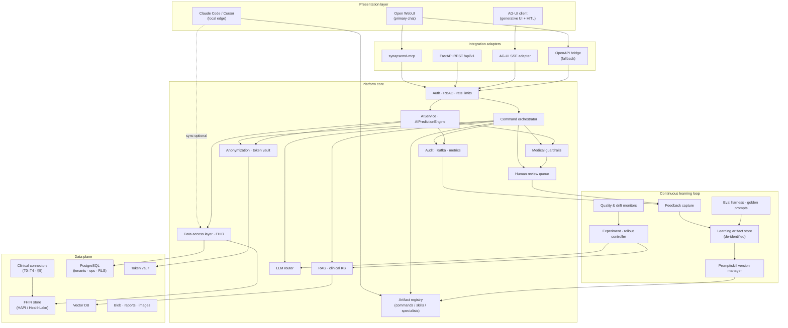
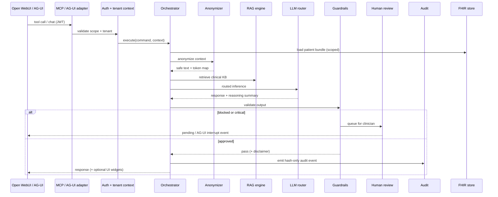
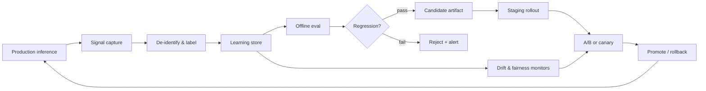

# SynapseMD Platform Architecture v2

**Status:** Proposed · **Audience:** Platform architects, product, engineering leads  
**Supersedes (partially):** [enterprise-architecture.md](enterprise-architecture.md) — which remains the compliance and data-model deep dive  
**Related:** [ui-mcp-integration.md](ui-mcp-integration.md) · [developer-guide.md](developer-guide.md) · [release-gates.md](release-gates.md)

---

## 1. Vision shift

SynapseMD v1 is a **file-based personal health repo** with an optional enterprise platform bolted on.  
SynapseMD v2 is an **enterprise multi-tenant, PHI-safe health intelligence platform** where:

- The **platform is the system of record** (FHIR, audit, tenancy, learning loop)
- **Commands, skills, and specialists** are versioned intelligence artifacts — editable as markdown in Git, deployed to a tenant-aware registry
- **CLI / local JSON mode** remains supported as a *personal edge deployment* (offline, developer, or privacy-maximalist users)
- **Open WebUI** is the default chat UI; **AG-UI** adds generative UI (charts, dashboards, human-in-the-loop) where chat alone is insufficient
- A **continuous learning closed loop** improves prompts, retrieval, routing, and clinical quality using de-identified feedback — never by leaking PHI into training pipelines

```text
v1 mental model:  Repo (files) + optional API
v2 mental model:  Platform (tenant-safe core) + artifact registry + UI adapters + optional local edge
```

---

## 2. Design principles

| # | Principle | Implication |
|---|-----------|-------------|
| P1 | **Platform-first** | FHIR + tenant isolation + audit are default; JSON files are legacy/edge only |
| P2 | **Markdown as source, registry as runtime** | `commands/`, `skills/`, `specialists/` stay human-editable; platform serves versioned snapshots per tenant |
| P3 | **PHI never crosses the LLM boundary raw** | Anonymize → infer → guardrail → audit (hash-only) → optional de-tokenize for authorized clinician view |
| P4 | **One intelligence engine, many surfaces** | Same orchestrator for REST, MCP, AG-UI stream, and CLI sync |
| P5 | **Learning without remembering PHI** | Feedback loops use redacted traces, structured labels, and golden eval — not patient-identifiable chat logs |
| P6 | **UI is thin** | Open WebUI / AG-UI never store health records; all reads/writes go through MCP/REST |
| P7 | **Human-in-the-loop by default for critical paths** | MDT, mental health, high-severity interactions, low-confidence outputs |
| P8 | **Certified connectors, not generic extract** | FHIR R4 canonical; external clinical data via tiered, tested connectors (§5) |

---

## 3. Target architecture (logical)



---

## 4. Layer responsibilities

### 4.1 Presentation layer

| Surface | Role | When to use |
|---------|------|-------------|
| **Open WebUI** | Default conversational UI for patients, members, internal ops | General Q&A, command execution via MCP tools, multi-model chat |
| **AG-UI** | Streaming agent events + generative UI components | Inline charts, trend dashboards, approval flows, shared canvas state |
| **CLI edge** | Local markdown commands + optional platform sync | Developers, air-gapped personal use, command authoring |

### 4.2 Integration adapters

All adapters call the **same** platform services — no duplicated business logic.

| Adapter | Protocol | Notes |
|---------|----------|-------|
| `synapsemd-mcp` | MCP stdio/SSE | Primary contract for Open WebUI tool calling |
| FastAPI REST | OpenAPI `/api/v1/*` | Integrations, mobile, EHR plugins |
| AG-UI adapter | HTTP POST + SSE event stream | New service: maps orchestrator events → AG-UI event types |
| OpenAPI bridge | REST shim | Fallback when Open WebUI cannot attach MCP natively |

### 4.3 Platform core (existing + extensions)

**Already implemented (Phase A–C baseline):**

- JWT auth, tenant isolation, RBAC scopes
- `CommandOrchestrator`, `AIService`, `AIPredictionEngine`
- Presidio/regex anonymization, medical guardrails, audit events
- MCP tools (`execute_command`, `ai_*`, FHIR query, RAG search)
- Release gates, eval harness skeleton

**v2 additions:**

| Component | Purpose |
|-----------|---------|
| **Artifact registry** | Versioned commands/skills/specialists per tenant + global defaults |
| **AG-UI adapter** | SSE stream of tool progress, structured UI payloads, HITL interrupts |
| **Learning pipeline** | Feedback ingestion, eval regression, staged artifact rollout |
| **FHIR-primary DAL** | Deprecate direct JSON reads in platform path; JSON via migration adapter only |
| **Generative UI schema** | Standard health widget types (chart, table, risk card, timeline) |

### 4.4 Data plane

```text
Canonical (v2):     FHIR R4 resources per {tenant_id, patient_id}
Operational:        PostgreSQL — tenants, users, consent, AI config, review queue
Embeddings:         Vector DB — clinical KB + tenant-approved corpora
Artifacts:          Object storage — report HTML/PDF, imaging blobs
Secrets:            Vault — PHI tokens, KMS DEKs per tenant
Edge (optional):    Local JSON mirror for CLI-only users (not synced to cloud unless opted in)
```

---

## 5. Clinical data integration

SynapseMD v2 treats **FHIR R4** as the canonical clinical wire format and integration boundary. External systems connect through **certified connectors** — not generic “extract from any FHIR/HL7 database” access.

**Thesis:**

> SynapseMD is a **FHIR-native intelligence layer**. It ingests and serves health data through a tenant-scoped clinical store, normalizes it for AI/commands/skills, and enforces PHI-safe audit — whether data originated in SynapseMD, migrated from personal JSON, or federated from an external clinical source.

### 5.1 What we mean (and do not mean)

| We mean | We do not mean |
|---------|----------------|
| FHIR R4 as **canonical internal model** | “Any FHIR-compliant server works out of the box” |
| **Certified connectors** per source type | Generic SQL/DB extraction from hospital databases |
| **Scoped read** or **controlled import** with consent | Bulk copy of full patient history without purpose limitation |
| **Normalization** to a SynapseMD clinical graph for AI/skills | Raw FHIR bundles fed directly to LLMs |
| HL7 v2 / CDA as **ingest pipelines → FHIR** (future) | “HL7 compliant DB” as a peer integration pattern |

FHIR **compliance ≠ interoperability**. Each connector must declare supported resources, search parameters, profiles, auth model, and tested EHR/version matrix.

### 5.2 Integration architecture

```text
┌──────────────────────────────────────────────────────────────────────────┐
│  CONNECTOR TIER (per source — tested, versioned, tenant-configured)      │
│  Tier 0: Native platform store · Tier 1: Bulk/migration ·              │
│  Tier 2: SMART-on-FHIR read · Tier 3: Enterprise EHR (Epic, Cerner…)   │
│  Future: HL7 v2 / CDA ingest → FHIR transform                            │
└───────────────────────────────┬──────────────────────────────────────────┘
                                │
                                ▼
┌──────────────────────────────────────────────────────────────────────────┐
│  INGESTION & NORMALIZATION                                               │
│  Validate ConformanceStatement · Map codes (LOINC/RxNorm/SNOMED)         │
│  De-dupe · Provenance · Link external Patient.id → {tenant_id, user_id} │
│  Conflict rules · Minimum-necessary subset selection                       │
└───────────────────────────────┬──────────────────────────────────────────┘
                                │
                                ▼
┌──────────────────────────────────────────────────────────────────────────┐
│  CANONICAL CLINICAL STORE (FHIR R4 + SynapseMD extensions)               │
│  DataAccessLayer → AIService · CommandOrchestrator · MCP · skills        │
└───────────────────────────────┬──────────────────────────────────────────┘
                                │
                                ▼
┌──────────────────────────────────────────────────────────────────────────┐
│  INTELLIGENCE LAYER (unchanged)                                          │
│  Anonymize → RAG → LLM → Guardrails → Audit (hash-only)                  │
└──────────────────────────────────────────────────────────────────────────┘
```

**Key layers:**

1. **Connector tier** — speaks the external protocol; returns FHIR bundles or NDJSON.
2. **Ingestion** — validates, maps identities, attaches `Provenance`, applies tenant scope.
3. **SynapseMD clinical graph** — normalized view consumed by `TenantHealthDataAdapter`, skills, and `AIPredictionEngine` (not raw vendor-specific shapes).
4. **Intelligence layer** — existing orchestrator; never reads external systems directly.

### 5.3 Connector tiers

Connectors are **productized integrations**, not plug-in drivers. Each ships with a conformance matrix, test suite, and release gate checklist.

| Tier | Connector | Pattern | SynapseMD role | Status |
|------|-----------|---------|----------------|--------|
| **T0** | **Platform native** | Read/write FHIR in tenant-scoped store (`FHIRLocalStore` / HAPI / HealthLake) | **System of record** | Partial (local store + DAL exist) |
| **T1** | **Legacy JSON migration** | One-time or periodic import from CLI `data/` trackers | **System of record** after import | Partial (`migrate_json_to_fhir.py`, `FHIR_MAPPINGS`) |
| **T1b** | **Bulk FHIR import** | `$import` / NDJSON bundle upload (IPS, patient export) | **System of record** or merge | Planned |
| **T2** | **SMART-on-FHIR read** | OAuth2 patient-scoped live read (Patient, Observation, MedicationRequest, …) | **Read federated adjunct**; SynapseMD caches normalized subset | Planned |
| **T3** | **Enterprise EHR** | Epic / Cerner / Meditech app registration + scoped APIs | **Read (± limited write) adjunct** | Future; per-vendor certification |
| **T4** | **HL7 v2 / CDA ingest** | MLLP / document feed → transform pipeline → FHIR | **Ingest only**; not a query target | Future; separate from FHIR REST |

**Tier selection by deployment:**

| Deployment | Primary tier | Notes |
|------------|--------------|-------|
| D2C / personal cloud | T0 + T1 | User owns data; optional edge JSON sync |
| Clinic pilot | T0 + T2 | SMART launch from patient portal; no full EHR extract |
| Hospital enterprise | T3 + T2 | BAA, app approval, scoped scopes; SynapseMD not default SOR |
| Developer / CI | T0 | Mock FHIR + fixture bundles |

**Connector contract (every tier implements):**

```python
# Conceptual — not yet implemented as single interface
class ClinicalConnector(Protocol):
    connector_id: str          # e.g. "smart-on-fhir.epic.us-core"
    tier: int
    supported_resources: list[str]
    async def fetch_patient_context(
        self, tenant_id: UUID, user_id: UUID, scopes: list[str]
    ) -> ClinicalBundle: ...
    async def health_check(self) -> ConnectorStatus: ...
```

### 5.4 Resource scope

Not all FHIR resources are required day one. Scope is driven by **what AI, commands, and release gates actually consume**, plus regulatory minimum-necessary discipline.

#### 5.4.1 Core resource set (v2.0 — P0/P1)

| FHIR resource | Clinical content | SynapseMD use | Legacy JSON mapping |
|---------------|------------------|---------------|---------------------|
| `Patient` | Demographics, gender, birth date | Profile, risk models, tenancy linkage | `profile.json` |
| `AllergyIntolerance` | Allergens, criticality | Interaction checks, consult | `allergies.json` |
| `MedicationRequest` | Active prescriptions | Interaction, AI analyze | `medications/` |
| `MedicationStatement` | Patient-reported meds | Adherence, reconciliation | `medications/` |
| `Observation` | Vitals, labs, fitness, sleep, nutrition | Trends, AI predict, skills | `*-tracker.json`, `lab-results/` |
| `Condition` | Problems, diagnoses | Consult, chronic disease skills | discharge, history |
| `Procedure` | Surgeries, implants | Consult, history | `surgery-records/` |
| `DiagnosticReport` | Lab/imaging report headers | Query, save-report linkage | `lab-results/`, `imaging/` |
| `ImagingStudy` | Radiation, modality | Radiation skill | `radiation-records.json` |
| `Encounter` | Visits, dates | Timeline, context windowing | index / visit logs |
| `DocumentReference` | PDF/HTML reports (pointer) | OCR pipeline input | `imaging/images/` |
| `Composition` | Discharge summaries | Consult, structured summaries | `discharge-summaries/` |
| `Immunization` | Vaccines | Vaccine commands | `vaccine` trackers |
| `Consent` | Data-use consent | Gate LLM calls per tenant policy | **New** |
| `Provenance` | Source system, timestamp | Audit, conflict resolution | **New** |

#### 5.4.2 Extended resource set (v2.x — P2+)

| Resource | Use |
|----------|-----|
| `CarePlan` / `Goal` | Goal-analyzer, care coordination |
| `FamilyMemberHistory` | Family-health-analyzer |
| `Device` | Implants, wearables |
| `ServiceRequest` | Orders, referrals |
| `Binary` | Embedded report bytes (with blob store offload) |

#### 5.4.3 SynapseMD-specific extensions (not standard FHIR)

Some product features **do not map cleanly** to core FHIR. These live as:

- **Platform extensions** — JSON blobs linked from FHIR (`Observation` with SynapseMD profile, or `Basic` resource with namespace)
- **Separate reference DBs** — drug interaction rules (`ClinicalUseDefinition` is aspirational; current A/B/C/D/X DB stays platform-managed)
- **Computed artifacts** — AI risk scores stored as `RiskAssessment` (FHIR) or internal audit-only records

Skills and commands should read through **DAL / clinical graph**, not assume a specific storage shape.

#### 5.4.4 Terminology requirements

| Domain | Code system | Requirement |
|--------|-------------|-------------|
| Labs | LOINC | Required for Observation mapping; text fallback flagged low confidence |
| Medications | RxNorm | Required for interaction engine |
| Conditions | SNOMED CT | Preferred; ICD-10-CM acceptable with map |
| Units | UCUM | Required for numeric Observation |
| Profiles | US Core (US), IPS (international summary) | Connector declares supported IG |

Unmapped codes surface as **data quality warnings** in audit metadata — not silent failure.

### 5.5 Integration patterns

| Pattern | Description | Write-back to source? |
|---------|-------------|------------------------|
| **A — SynapseMD as SOR** | T0/T1; all CRUD via platform API/MCP | N/A (SynapseMD owns data) |
| **B — Federated read cache** | T2/T3 periodic or on-demand pull; normalized subset stored with TTL | No |
| **C — Patient-mediated SMART launch** | User authorizes scoped read each session or refresh token | No (v2) |
| **D — Bulk migration** | One-time IPS/export for onboarding | No |
| **E — Edge sync (opt-in)** | CLI JSON → encrypted upload → merge | Platform wins on conflict |

**Default for enterprise adjacency:** Pattern **B + C** — live scoped read where needed, cached normalized graph for AI latency, **never** full-history extract by default.

### 5.6 Identity, provenance, and conflicts

Every external record must answer: **whose data is this, where did it come from, and which copy wins?**

```text
External id:  epic://Patient/abc123
Internal id:    {tenant_id}/{user_id} → FHIR bundle path
Provenance:     Provenance.target → resource refs; agent = connector_id
```

| Concern | Policy |
|---------|--------|
| **Identity map** | Table: `(tenant_id, source_system, external_patient_id) → user_id` |
| **Provenance** | Mandatory on every ingested resource; connector_id + retrieved_at |
| **Conflict** | Default: **external EHR wins** for clinical facts; **SynapseMD wins** for user-entered wellness trackers unless clinician merge |
| **Stale data** | `meta.lastUpdated` tracked; AI responses include freshness metadata |
| **Minimum necessary** | Connector config lists allowed resource types per use case (e.g. AI chat vs full consult) |

### 5.7 Normalization — SynapseMD clinical graph

Raw FHIR is insufficient for skills designed around domain trackers. The **clinical graph** is the internal read model:

```text
FHIR bundle (canonical store)
        │
        ▼
ClinicalGraphBuilder
        ├── patient_summary
        ├── active_medications[]
        ├── allergies[]
        ├── recent_observations[] (by LOINC category)
        ├── conditions[]
        ├── encounters[] (windowed)
        └── provenance_meta
        │
        ▼
TenantHealthDataAdapter → AIPredictionEngine / AIService / skills
```

This layer already exists in embryo (`TenantHealthDataAdapter`, `DataAccessLayer`); v2 expands it to be **connector-aware** and **profile-validated**.

### 5.8 Explicit non-goals

These are **out of scope** for SynapseMD v2 unless a future ADR explicitly revises them:

| Non-goal | Rationale |
|----------|-----------|
| **Universal “any FHIR server” adapter** | Compliance statements differ; unsupported resources break AI silently |
| **Direct HL7 v2 / CDA query interface** | Different protocols; ingest-only via transform pipelines |
| **Bulk extract of full patient history by default** | HIPAA minimum necessary; EHR scopes won't allow it; storage cost |
| **SynapseMD as default write-back target for EHR** | Requires bilateral integration, medication ordering workflows, medico-legal liability |
| **Real-time ADT/event-driven hospital feed (v2.0)** | Interface engine complexity; Tier 4 future |
| **Replacing the EHR** | Intelligence layer only; chart remains source of truth for enterprise |
| **Storing PHI in chat UI databases** | Open WebUI / AG-UI are presentation only |
| **Training LLMs on raw connector payloads** | Learning loop uses de-identified signals only (ADR-009) |
| **Cross-tenant clinical data pooling** | Tenant isolation is non-negotiable; federated learning is opt-in aggregates only |
| **Guaranteeing completeness of external data** | Connector declares coverage; gaps disclosed to user/clinician |

### 5.9 Compliance and consent hooks

| Requirement | Implementation |
|-------------|----------------|
| **Patient consent** | FHIR `Consent` resource; checked before T2/T3 fetch |
| **Purpose limitation** | Connector scoped to use case (`ai_chat` vs `consult` resource subsets) |
| **Audit** | Every connector fetch → audit event (source, resource types, record counts — not PHI bodies) |
| **BAA** | Required for T3 cloud EHR + LLM providers; tracked in [baa-tracking.md](../docs/baa-tracking.md) |
| **Export / erasure** | Admin APIs export FHIR bundle; erasure revokes tokens + deletes tenant bundle |

### 5.10 Implementation mapping (current codebase)

| v2 capability | Starting point |
|---------------|----------------|
| FHIR mappings | `platform/synapsemd_platform/fhir/migration.py` — `FHIR_MAPPINGS`, `profile_to_patient`, etc. |
| DAL | `DataAccessLayer`, `FHIRLocalStore` |
| JSON migration | `platform/scripts/migrate_json_to_fhir.py`, admin export/erase routes |
| Tenant adapter | `TenantHealthDataAdapter` in `ai/data_adapter.py` |
| MCP FHIR query | `query_fhir_records` MCP tool |
| HAPI (dev/full stack) | `docker-compose.yml` `hapi-fhir` service; `FHIR_USE_HAPI` env |
| SMART-on-FHIR connector | **New:** `platform/synapsemd_platform/connectors/smart_fhir.py` |
| Connector registry | **New:** `platform/synapsemd_platform/connectors/registry.py` |
| Clinical graph builder | **New:** extend `TenantHealthDataAdapter` |
| Conformance tests | **New:** `tests/integration/connectors/` per tier |

### 5.11 Roadmap alignment

| Phase | Clinical data deliverables |
|-------|---------------------------|
| **Phase 1** | T0 production-hardened; T1 JSON migration complete; clinical graph v1; resource scope P0 |
| **Phase 2** | T1b bulk FHIR import; Consent + Provenance; data quality metrics |
| **Phase 3** | T2 SMART-on-FHIR read connector (US Core Patient + Observation + MedicationRequest) |
| **Phase 4** | T3 first enterprise EHR (single vendor); conformance certification doc |
| **Future** | T4 HL7 v2 ORU → Observation pipeline; limited write-back ADR if needed |

---

## 6. Artifact registry — commands, skills, specialists as first-class platform objects

Today markdown files live in Git and symlink to `.claude/`. In v2 they become **deployable artifacts**:

```text
Git repo (authoring)          Platform registry (runtime)
─────────────────────         ────────────────────────────
commands/ai.md        ──CI──▶  artifact://global/commands/ai@1.4.2
skills/nutrition-*/           artifact://tenant/{id}/skills/nutrition-analyzer@2.1.0
specialists/cardiology.md     artifact://global/specialists/cardiology@1.0.0
```

**Artifact record (conceptual):**

```json
{
  "id": "command/ai",
  "version": "1.4.2",
  "scope": "global",
  "content_hash": "sha256:…",
  "uri": "s3://artifacts/commands/ai/1.4.2.md",
  "metadata": {
    "complexity": "complex",
    "requires_human_review": false,
    "data_domains": ["profile", "lab-results", "medications"],
    "platform_tools": ["ai_analyze", "ai_predict"]
  },
  "status": "active"
}
```

**Resolution order:** tenant override → org bundle → global default.

**CLI edge mode:** `synapsemd pull artifacts` syncs registry → local `commands/` for offline Claude Code use. Local edits push back via PR — not direct production mutation.

This preserves the developer guide workflow while making the platform the runtime authority for hosted tenants.

---

## 7. Multi-tenant PHI-safe execution path

Every hosted request follows the same pipeline (already largely built; v2 hardens FHIR-only path):



**Non-negotiable boundaries:**

| Zone | PHI allowed? |
|------|----------------|
| FHIR store (encrypted, RLS) | Yes |
| Token vault | Yes (encrypted) |
| LLM request/response | **No** (anonymized only) |
| Audit log | **No** (hashes + token refs) |
| Open WebUI persistent chat DB | **No health records** |
| Learning store | **No** (de-identified structured labels only) |

---

## 8. Continuous learning closed loop

The learning loop **improves quality** without turning the platform into a PHI training repository.

### 8.1 Loop overview



### 8.2 Signal sources (what we learn from)

| Signal | Source | PHI handling | Used for |
|--------|--------|--------------|----------|
| Explicit feedback | User thumbs up/down in Open WebUI | Store interaction_id + label only | Preference tuning, failure mining |
| Clinician correction | Human review queue edits | Store diff of *anonymized* output | Prompt/skill patches |
| Guardrail blocks | `MedicalGuardrails` | Structured reason codes | Safety rule tuning |
| Eval harness | `tests/eval/` golden prompts | Synthetic/fixture data | Regression gate before promote |
| Outcome labels | Optional EHR webhook (future) | De-identified cohort stats | Risk model calibration |
| RAG miss logs | Zero-hit or low-score retrieval | Query intent + entity codes (no free-text PHI) | KB gap analysis |

### 8.3 Learning store schema (conceptual)

```sql
-- No PHI columns — references audit by interaction_id hash only
CREATE TABLE learning_signals (
  id              UUID PRIMARY KEY,
  tenant_id       UUID,
  interaction_hash TEXT NOT NULL,
  signal_type     TEXT,  -- feedback | correction | guardrail | rag_miss
  label           JSONB, -- {rating: -1, reason: "unsupported_claim", ...}
  artifact_refs   JSONB, -- {command: "ai@1.4.2", skill: "nutrition-analyzer@2.1.0"}
  model_id        TEXT,
  created_at      TIMESTAMPTZ
);

CREATE TABLE artifact_experiments (
  id              UUID PRIMARY KEY,
  tenant_id       UUID,
  baseline_version TEXT,
  candidate_version TEXT,
  metric          JSONB, -- {eval_pass_rate, guardrail_block_rate, user_rating_delta}
  status          TEXT,  -- canary | promoted | rolled_back
  started_at      TIMESTAMPTZ,
  ended_at        TIMESTAMPTZ
);
```

### 8.4 What gets updated (closed-loop outputs)

| Output | Mechanism | Human approval |
|--------|-----------|----------------|
| Prompt / command markdown patch | PR from learning pipeline → Git → registry deploy | Required for clinical artifacts |
| RAG corpus additions | Ingest guideline PDF → chunk → embed | Content reviewer sign-off |
| Router complexity table | Config change per command class | Platform admin |
| Retrieval weights / reranker | Experiment controller | Auto within guardrails |
| Fine-tune dataset (optional) | Export de-identified (Safe Harbor) pairs | Legal + compliance review |
| Golden prompt expansion | Add failing case to `tests/eval/` | Engineering |

### 8.5 Learning loop guardrails

1. **No automatic promotion** of clinical command/skill changes without eval pass + release gate check
2. **Tenant isolation** — learning signals aggregated per tenant; cross-tenant learning only on explicitly opted-in, de-identified cohorts
3. **Rollback in one click** — artifact registry keeps N previous versions
4. **Audit every promotion** — who approved, eval scores, diff hash
5. **Bias/fairness monitor** — async job on aggregated labels (see enterprise-architecture §8)

### 8.6 Implementation mapping to current codebase

| v2 component | Starting point in repo |
|--------------|------------------------|
| Eval gate | `tests/eval/`, `tests/release/` |
| Reasoning capture | `ReasoningSummary`, audit events |
| Human review queue | `requires_human_review`, governance module |
| Feedback API | **New:** `POST /api/v1/feedback` |
| Experiment controller | **New:** `platform/synapsemd_platform/learning/` |
| Prompt registry | **New:** wraps Git sync + S3/version table |

---

## 9. UI architecture — Open WebUI + AG-UI

### 9.1 Recommended split

| Capability | Open WebUI | AG-UI |
|------------|------------|-------|
| Chat, history, models | ✅ Primary | Optional |
| MCP tool calling | ✅ Via `synapsemd-mcp` or bridge | Via same backend |
| Auth (JWT passthrough) | ✅ Per-request Bearer | ✅ |
| Inline charts / health dashboards | ⚠️ Limited native | ✅ Generative UI events |
| Human-in-the-loop approve/edit | ⚠️ Basic | ✅ Interrupt / resume events |
| Shared state (care plan canvas) | ❌ | ✅ STATE_DELTA / STATE_SNAPSHOT |
| Time-to-ship | **Fast** — use now | Phase 2 — high-value screens |

**Recommendation:** Ship **Open WebUI first** for conversational health assistant; add **AG-UI adapter** for rich visual analytics and clinician review UX.

### 9.2 Open WebUI integration (Phase UI-1)

```text
┌──────────────── Open WebUI ────────────────┐
│  Chat UI · model picker · user accounts     │
│  External tools: synapsemd MCP server       │
└────────────────────┬────────────────────────┘
                     │ MCP (stdio/SSE) or
                     │ OpenAPI bridge :8100
                     ▼
              synapsemd-mcp / platform API
```

**Configuration checklist:**

1. Deploy platform API + MCP sidecar (existing `deploy/k8s/base/mcp-deployment.yaml`)
2. Register Open WebUI workspace tool → `synapsemd-mcp` with `SYNAPSEMD_ACCESS_TOKEN`
3. Enable tools: `ai_analyze`, `ai_predict`, `ai_chat`, `execute_command`, `query_fhir_records`
4. **Disable** Open WebUI persistent storage of tool raw responses containing tokens
5. Custom system prompt: health disclaimer + "always use tools for health data"

**Open WebUI function tools for charts (optional enhancement):**

When MCP returns structured time-series JSON, an Open WebUI **custom function** or **filter** renders ECharts using templates from `skills/health-trend-analyzer/templates/`:

```python
# deploy/openwebui-functions/render_health_chart.py (conceptual)
def render_chart(tool_result: dict) -> str:
    """Return markdown with embedded chart spec for Open WebUI HTML preview."""
    return f"```echarts\n{tool_result['chart_spec']}\n```"
```

Alternatively, MCP tool `ai_analyze` returns a `ui_payload` field with pre-built chart config — Open WebUI displays via markdown/HTML plugin.

### 9.3 AG-UI integration (Phase UI-2)

AG-UI sits **parallel** to MCP — both talk to the same orchestrator:

```text
AG-UI client (React / CopilotKit)
        │ POST + SSE
        ▼
synapsemd-ag-ui-adapter  (/v1/agent/stream)
        │
        ├── maps RUN_STARTED, TEXT_MESSAGE_CONTENT, TOOL_CALL_* events
        ├── emits generative UI: HEALTH_CHART, RISK_CARD, TIMELINE
        └── emits HITL_INTERRUPT for human review
        ▼
CommandOrchestrator / AIService
```

**AG-UI event mapping (proposed):**

| Platform event | AG-UI event | Payload |
|----------------|-------------|---------|
| Orchestration start | `RUN_STARTED` | `{ interaction_id, command }` |
| LLM token | `TEXT_MESSAGE_CONTENT` | `{ delta }` |
| MCP tool invoke | `TOOL_CALL_START/END` | `{ tool: "ai_predict", args }` |
| Chart ready | Custom `UI_COMPONENT` | `{ type: "health_chart", spec }` |
| Review required | `RUN_INTERRUPTED` | `{ queue_id, summary }` |
| Clinician approves | `RUN_RESUMED` | `{ approved_text }` |

**Generative UI widget catalog (v2):**

| Widget | Source skill/command | Data |
|--------|---------------------|------|
| `HealthTrendChart` | health-trend-analyzer | Observation time series |
| `RiskScoreCard` | ai predict | AIPredictionEngine output |
| `MedicationTimeline` | medication + interaction | FHIR MedicationRequest |
| `MDTReport` | consult | Specialist sections |
| `LabResultsTable` | query / save-report | DiagnosticReport |

Implement widget schemas once in `platform/synapsemd_platform/ui/schemas.py`; AG-UI and Open WebUI chart functions both consume them.

### 9.4 UI comparison decision matrix

| Criterion | Open WebUI | AG-UI |
|-----------|------------|-------|
| Maturity / self-host | Excellent | Growing (CopilotKit ecosystem) |
| MCP native | Via external server | N/A — uses agent stream |
| Generative UI | Plugins needed | Native design goal |
| Clinician HITL | Manual | Protocol-level interrupts |
| Effort to integrate | **Low** (already spiked) | **Medium** (new SSE adapter) |
| Recommended phase | **Now** | **Next** for analytics + review UI |

---

## 10. CLI edge mode (preserved, re-positioned)

Local CLI remains valuable for:

- Authoring commands/skills (developer guide workflow)
- Fully offline personal use
- Demos without infrastructure

**Edge sync model (optional):**

```text
┌──────────── Local edge ────────────┐
│  commands/ skills/ specialists/    │
│  data/ (JSON mirror)               │
│  Claude Code                       │
└──────────────┬─────────────────────┘
               │ opt-in sync (encrypted)
               ▼
        Platform FHIR + registry
```

- **Default:** edge stays local; no cloud PHI
- **Opt-in sync:** encrypted upload of FHIR bundles; conflict resolution favors platform for hosted tenants
- **Authoring loop:** Git PR → CI validates artifacts → registry promote → edge `pull`

---

## 11. Service topology (deployment)

```text
┌──────────────────────── Kubernetes namespace: synapsemd ────────────────────────┐
│                                                                                 │
│  Ingress (TLS)                                                                  │
│    ├── api.synapsemd.com        → platform-api (FastAPI)                        │
│    ├── mcp.synapsemd.com        → mcp-server (SSE)                              │
│    ├── agui.synapsemd.com       → ag-ui-adapter (SSE)          [v2 new]         │
│    └── chat.synapsemd.com       → open-webui                                    │
│                                                                                 │
│  Workloads                                                                      │
│    platform-api · mcp-server · ag-ui-adapter · open-webui                       │
│    presidio-analyzer · kafka · prometheus                                       │
│                                                                                 │
│  Data                                                                           │
│    postgres (RLS) · hapi-fhir · weaviate · s3 · vault                           │
│                                                                                 │
└─────────────────────────────────────────────────────────────────────────────────┘
```

**Docker Compose (dev):** extend existing `platform/docker-compose.yml` with `open-webui` and `ag-ui-adapter` profiles.

---

## 12. Migration roadmap

### Phase 0 — Foundation (done ✓)

- Modular monolith, auth, MCP, AI routes, anonymization, audit, release gates, 266+ tests

### Phase 1 — Platform as product (8–10 weeks)

| Workstream | Deliverables |
|------------|--------------|
| **FHIR-primary** | All platform reads/writes via DAL; JSON adapter deprecated in API path |
| **Clinical graph v1** | `TenantHealthDataAdapter` expanded; P0 resource scope (§5.4.1) |
| **T0 + T1 connectors** | Production-hardened native store; complete JSON → FHIR migration path |
| **Artifact registry v1** | Load commands/skills from Git tag at deploy; tenant config pins version |
| **Open WebUI production** | K8s manifest, JWT flow, QA checklist, chart function POC |
| **Feedback API v1** | `POST /feedback` → learning_signals table |

### Phase 2 — Learning loop (6–8 weeks)

| Workstream | Deliverables |
|------------|--------------|
| **Eval gate in CI/CD** | No artifact promote without `tests/eval/` pass |
| **Experiment controller** | Canary per tenant; rollback |
| **Review dashboard** | Clinician UI (AG-UI or admin React) for human review queue |
| **RAG gap pipeline** | Log misses → content backlog |
| **T1b bulk FHIR import** | IPS/NDJSON onboarding; Consent + Provenance resources |

### Phase 3 — AG-UI & generative health UI (6–8 weeks)

| Workstream | Deliverables |
|------------|--------------|
| **AG-UI adapter** | SSE endpoint, event mapping, HITL interrupt/resume |
| **Widget catalog** | Chart, risk card, lab table schemas |
| **Open WebUI chart skills** | ECharts templates wired to `ai_analyze` output |
| **T2 SMART-on-FHIR** | Patient-scoped read connector; US Core P0 resources |

### Phase 4 — Enterprise hardening (ongoing)

- SOC 2 evidence automation, backup drills, multi-region, BAA-tracked LLM providers
- Optional: org-specific fine-tune pipeline (de-identified export only)
- T3 first certified enterprise EHR connector (single vendor)
- Future: T4 HL7 v2 ingest pipeline (ADR-gated)

---

## 13. New ADRs to adopt

| ADR | Decision |
|-----|----------|
| ADR-006 | Platform-first; CLI is edge deployment mode |
| ADR-007 | Open WebUI default UI; AG-UI for generative + HITL |
| ADR-008 | Artifact registry owns runtime command/skill versions |
| ADR-009 | Learning loop uses interaction hashes only — no PHI in learning store |
| ADR-010 | AG-UI adapter shares orchestrator with MCP — no forked logic |
| ADR-011 | FHIR canonical; JSON files legacy edge only |
| ADR-012 | Clinical data via certified connector tiers only — no generic FHIR/HL7 DB extract |
| ADR-013 | External EHR is read-federated adjunct by default; SynapseMD SOR for D2C |

---

## 14. Open decisions (for your review)

1. **Single vs dual UI long-term** — Open WebUI only + plugins, or Open WebUI (chat) + AG-UI (clinical dashboards)?
2. **Artifact registry storage** — S3 + DB metadata vs Git-as-DB with platform cache?
3. **Cross-tenant learning** — strictly forbidden vs opt-in federated eval on de-identified aggregates?
4. **FHIR cutover** — big-bang migration vs dual-write period with JSON fallback?
5. **AG-UI client** — CopilotKit React shell vs custom minimal SSE client?
6. **First T3 EHR vendor** — Epic vs Cerner vs open HAPI-only for enterprise pilot?
7. **Clinical graph storage** — materialized view in Postgres vs build-on-read from FHIR bundle?

---

## 15. Summary

SynapseMD v2 reframes the product as an **enterprise health intelligence platform** with:

- **Tenant-safe FHIR core** and hash-only audit
- **Certified clinical connectors** (Tier 0–4) with explicit resource scope and non-goals — not generic EHR extract
- **Versioned markdown artifacts** (commands/skills/specialists) deployed through a registry
- **Open WebUI now** for chat + MCP tools; **AG-UI next** for charts and clinician HITL
- A **continuous learning loop** that improves artifacts and retrieval through de-identified feedback and eval gates — not PHI memorization

The existing repo investments (orchestrator, AI engine, MCP, release gates, markdown authoring model) remain valid. v2 **elevates the platform to primary** and adds the missing **learning** and **generative UI** layers rather than replacing what works.

---

*Document version: 2.1-proposed · July 2026*
